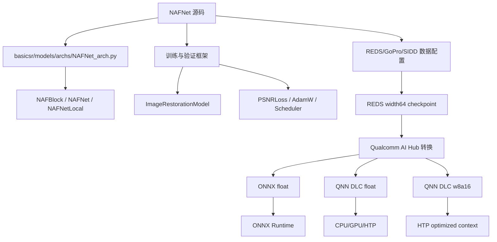
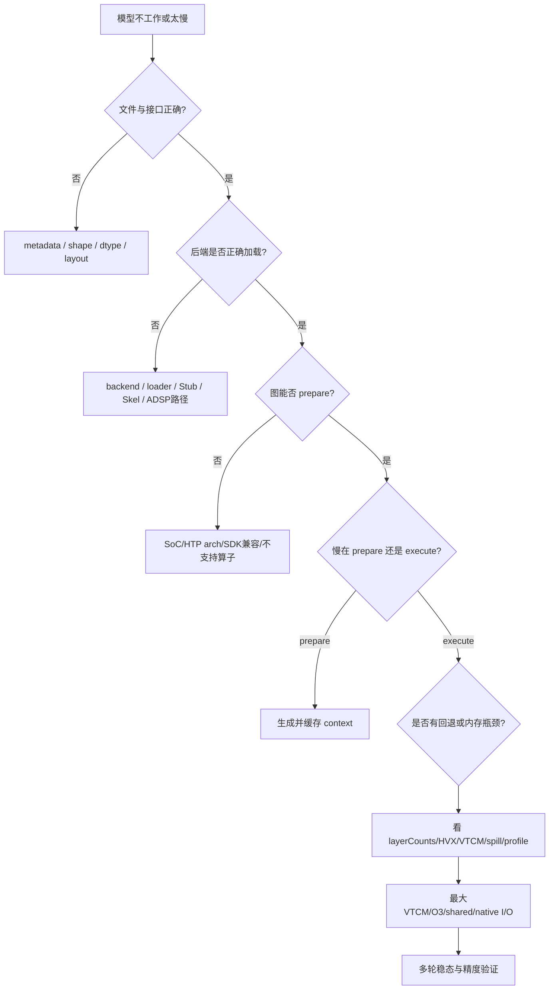
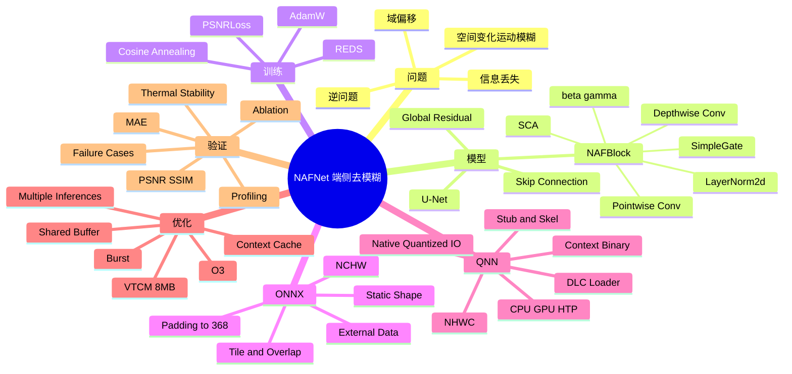

# NAFNet 去模糊完整工程报告

> 文档日期：2026-07-31  
> 适用对象：算法、端侧推理、性能优化、测试、产品与技术管理人员  
> 覆盖范围：问题定义、模型原理、源码拆解、ONNX/QNN 部署、SM8850 HTP 优化、调试、验证、局限与后续决策

---

## 0. 阅读约定

为防止把经验判断写成确定结论，本文使用三类标签：

- **[事实]**：可由本地源码、模型元数据、context 元数据或 profiling 重复得到。
- **[推测]**：与现有证据一致，但还缺少控制变量或底层计数器验证。
- **[建议]**：下一步工程动作，不代表当前已经完成。

关键证据目录：

```text
/media/code/tools/naf/NAFNet
/media/code/tools/naf/nafnet_deblur-onnx-float
/media/code/tools/naf/nafnet_deblur-qnn_dlc-float
/media/code/tools/naf/nafnet_deblur-qnn_dlc-w8a16
```

---

## 1. 执行摘要

### 1.1 模型定位

当前模型是 `NAFNet-REDS-width64`，不是 GoPro checkpoint。它接受 `640×360` RGB 图像，输出同尺寸去模糊图像，目标退化包含运动模糊和 JPEG 伪影。

### 1.2 关键工程结论

1. **模型原理：**NAFNet 是四层 U-Net，核心 NAFBlock 使用 `LayerNorm2d + 1×1 Conv + Depthwise Conv + SimpleGate + SCA + 双残差`。
2. **“无激活”含义：**它去掉的是 ReLU/GELU/Sigmoid 等传统激活，非线性仍由乘法门控提供。
3. **模型规模：**约 67.89M 参数、36 个 NAFBlock，计算和参数主要集中在第 4 个编码阶段的 28 个块。
4. **ONNX 特征：**固定 NCHW `[1,3,360,640]`，高度内部补到 368，再裁回 360。
5. **QNN 接口：**DLC 需要通过 `libQnnModelDlc.so + --dlc_path` 加载；HTP 建议先生成 context binary。
6. **性能根因：**默认 context 只使用 4 MB VTCM；NAFNet 的大中间特征导致明显 spill/fill 和 DDR 搬运。
7. **决定性优化：**`最大 VTCM + O=3 + shared buffer + context cache` 把 w8a16 accelerator 延迟从 `327.597 ms` 降到 `43.819 ms`，约 7.48 倍。
8. **同精度官网对齐：**w8a16 本机 `43.819 ms`，页面同类设备数据约 `39.251 ms`，差约 11.6%；约 17 ms 是 w8a8 数据，不能直接比较。
9. **正确性：**O3 优化前后 w8a16 原生输出逐元素一致；w8a16 相对 float HTP 的 PSNR 为 `54.69 dB`。
10. **验收边界：**上述证明部署链路正确且性能优化有效，但不能代替 REDS val300 的正式质量验收。

---

## 2. 第一性原理：为什么去模糊困难

### 2.1 观测过程

运动模糊可以抽象为：

$$
B=\mathcal{K}(S)+N
$$

其中：

- `S` 是清晰场景；
- `B` 是传感器记录的模糊图；
- `K` 不是一个固定卷积核，而可能随位置、深度、物体运动和滚动快门变化；
- `N` 包括传感器噪声、ISP、压缩和量化误差。

### 2.2 本质约束

1. **信息混合：**多个清晰位置在曝光时间内累积到同一像素。
2. **信息丢失：**高频边缘经过模糊后衰减，无法靠确定性逆运算完整找回。
3. **解不唯一：**不同清晰图可能产生相似模糊观测。
4. **空间变化：**真实运动通常不是整图同一方向、同一长度。
5. **域偏移：**标准数据集与具体手机的快门、ISP、噪声和压缩链不同。

### 2.3 设计需求推导

从约束反推，恢复网络至少需要：

- 局部纹理建模；
- 大感受野和多尺度语义；
- 高频细节跨层保存；
- 稳定残差学习；
- 足够强但可部署的非线性；
- 对亮度、噪声和压缩变化的鲁棒性。

NAFNet 的 U-Net、深度卷积、门控、SCA 和全局图像残差分别对应这些需求。

---

## 3. 项目结构与职责



核心文件：

| 文件/目录 | 作用 |
|---|---|
| `NAFNet/basicsr/models/archs/NAFNet_arch.py` | NAFBlock、NAFNet、NAFNetLocal 定义 |
| `NAFNet/basicsr/models/image_restoration_model.py` | 训练、验证、损失、指标与图像保存 |
| `NAFNet/basicsr/data/reds_dataset.py` | REDS 数据读取 |
| `nafnet_deblur-onnx-float/inference.py` | ONNX Runtime resize/tile 推理 |
| `nafnet_deblur-qnn_dlc-float/run_on_device.sh` | float DLC CPU/GPU/HTP 自动运行 |
| `nafnet_deblur-qnn_dlc-w8a16/run_on_device.sh` | w8a16 原生 I/O 与 optimized HTP context |
| `htp_max_vtcm_o3.json` | 最大 VTCM、O3、burst 配置 |
| `benchmark_results.json` | 本机基准和消融数据 |

---

## 4. 网络结构反推

### 4.1 总体结构

NAFNet 是单阶段四层编码器/解码器网络：

```mermaid
flowchart LR
    I[Input 3ch] --> Intro[Intro Conv width=64]
    Intro --> E0[Encoder: 1 block]
    E0 --> DS0[Downsample]
    DS0 --> E1[Encoder: 1 block]
    E1 --> DS1[Downsample]
    DS1 --> E2[Encoder: 1 block]
    E2 --> DS2[Downsample]
    DS2 --> E3[Encoder: 28 blocks]
    E3 --> DS3[Downsample]
    DS3 --> Mid[Middle: 1 block]
    Mid --> U3[Upsample + Skip + 1 block]
    U3 --> U2[Upsample + Skip + 1 block]
    U2 --> U1[Upsample + Skip + 1 block]
    U1 --> U0[Upsample + Skip + 1 block]
    U0 --> End[Ending Conv]
    End --> Add[Add original input]
    Add --> O[Output]
```



REDS width64 配置：

| 参数 | 值 |
|---|---:|
| 基础宽度 | 64 |
| 编码器块 | `[1,1,1,28]` |
| 中间块 | `1` |
| 解码器块 | `[1,1,1,1]` |
| NAFBlock 总数 | 36 |
| 下采样次数 | 4 |
| 输入对齐倍数 | 16 |

### 4.2 NAFBlock

源码等价流程：

```text
inp
 ├─ Norm1 → 1×1 Conv → DW 3×3 Conv → SimpleGate → SCA → 1×1 Conv
 │                                                       │
 └──────────────────── inp + beta × branch ─────────────┘ = y

y
 ├─ Norm2 → 1×1 Conv → SimpleGate → 1×1 Conv
 │                                      │
 └──────────────── y + gamma × branch ─┘ = output
```

#### SimpleGate

$$
SG(x)=x_1\odot x_2
$$

它把通道一分为二后逐元素相乘。乘法产生输入相关的二阶交互，因此网络仍是非线性的。

#### SCA

$$
SCA(x)=x\odot W(AvgPool(x))
$$

它用全局平均池化压缩空间维度，再通过 `1×1 Conv` 生成通道权重，没有传统注意力中的多层 MLP 和 Sigmoid。

#### β/γ 零初始化

`beta`、`gamma` 初始为 0，使每个块训练初期接近恒等映射。这样可以先保证深网稳定，再逐步学习残差修改。

### 4.3 为什么有效

- **多尺度：**低分辨率层扩大有效感受野，应对长运动轨迹。
- **Skip：**高分辨率细节不必穿过最深瓶颈，可直接送到解码器。
- **Depthwise Conv：**低成本建立空间局部关系。
- **1×1 Conv：**负责通道混合和特征重组。
- **SimpleGate：**用低成本乘法提供动态非线性。
- **SCA：**按图像内容调整通道贡献。
- **全局残差：**网络只学习“模糊图应该改多少”，而不是从零生成整张图。

### 4.4 Local/TLC 与当前 ONNX 的差异

源码 `NAFNetLocal` 可把全局统计转换为局部统计，降低训练裁剪和全图推理之间的统计偏差。当前 ONNX 图中存在 36 个 `GlobalAveragePool`，没有局部池化图，因此当前导出并未保留 TLC 图结构。

---

## 5. 训练设计

| 维度 | 配置 |
|---|---|
| 数据 | REDS 模糊/清晰对 |
| 裁剪 | `256×256` |
| 增强 | 翻转、旋转 |
| 优化器 | AdamW |
| 初始学习率 | `1e-3` |
| Weight decay | `1e-3` |
| Betas | `[0.9,0.9]` |
| 调度 | True Cosine Annealing |
| 训练迭代 | 400,000 |
| 损失 | PSNRLoss |

PSNRLoss 本质是 MSE 的单调变换：

$$
L=\frac{10}{\ln 10}\ln(MSE(\hat S,S)+10^{-8})
$$

这样训练目标与 PSNR 评价方向一致，但也会继承像素损失的限制：严重不确定区域可能倾向平均化和过度平滑。

---

## 6. ONNX 逆向结果

### 6.1 协议规格

| 项目 | 结果 |
|---|---|
| 模型 | `nafnet_deblur.onnx` |
| 外部权重 | `nafnet_deblur.data` |
| 输入 | float32 NCHW `[1,3,360,640]` |
| 输出 | float32 NCHW `[1,3,360,640]` |
| 参数 | 67,888,835 |
| 图节点 | 813 |
| Initializer | 674 |
| Conv | 226 |
| LayerNormalization | 72 |
| Split | 72 |
| GlobalAveragePool | 36 |
| DepthToSpace | 4 |
| 估算 Conv MACs | 约 226.58G/张 |

### 6.2 固定尺寸和 Padding

四次下采样要求高宽是 16 的倍数：

$$
360\rightarrow368\rightarrow184\rightarrow92\rightarrow46\rightarrow23
$$

宽度 640 已满足要求，高度 360 需要补到 368。输出最终裁回 360 行。

### 6.3 ONNX 推理模式

#### Resize

- 把任意输入缩放到 `640×360`；
- 延迟固定；
- 会改变长宽比或丢失原始分辨率。

#### Tile

- 保持原图尺寸；
- 逐块运行固定尺寸模型；
- 无重叠时容易产生接缝；
- 重叠融合改善边界，但推理次数和延迟增加。

---

## 7. QNN DLC 部署链路

### 7.1 为什么不能直接 `--model nafnet_deblur.dlc`

DLC 是模型容器，需要使用 DLC loader：

```bash
qnn-net-run \
  --backend libQnnCpu.so \
  --model libQnnModelDlc.so \
  --dlc_path nafnet_deblur.dlc \
  --input_list input_list.txt
```

HTP 推荐先生成 context：

```bash
qnn-context-binary-generator \
  --backend libQnnHtp.so \
  --model libQnnModelDlc.so \
  --dlc_path nafnet_deblur.dlc \
  --config_file htp_netrun_o3_config.json \
  --output_dir context_htp \
  --binary_file nafnet_htp_v81_maxvtcm_o3
```

然后加载 context：

```bash
qnn-net-run \
  --backend libQnnHtp.so \
  --retrieve_context context_htp/nafnet_htp_v81_maxvtcm_o3.bin \
  --config_file htp_netrun_o3_config.json \
  --input_list input_list.txt \
  --perf_profile burst \
  --shared_buffer \
  --num_inferences 50 \
  --keep_num_outputs 1 \
  --profiling_level basic
```

### 7.2 设备依赖

当前设备：

| 项目 | 值 |
|---|---|
| 型号 | Xiaomi `2512BPNDAC` |
| SoC | SM8850 |
| QNN soc_model | 87 |
| HTP 架构 | v81 |
| Android | 16 |
| HTP HVX 线程 | 8 |
| 最大 QNN 图 VTCM | 8 MB |

需要推送的主要组件：

- `qnn-net-run`
- `qnn-context-binary-generator`
- `qnn-profile-viewer`
- `libQnnModelDlc.so`
- `libQnnSystem.so`
- `libQnnHtp.so`
- `libQnnHtpV81Stub.so`
- `libQnnHtpV81Skel.so`
- `libQnnHtpPrepare.so`
- `libQnnHtpNetRunExtensions.so`

---

## 8. float 与 w8a16 I/O

### 8.1 float DLC

- 输入输出：NHWC float32；
- 输入值域 `[0,1]`；
- 默认读取和写出即为模型原生格式。

### 8.2 w8a16 DLC

输入量化：

$$
q=round(x/scale+zeroPoint)
$$

当前输入：

- dtype：uint16；
- scale：`1.5259021893143654e-05`；
- zero point：0。

输出反量化：

$$
x=(q-zeroPoint)\times scale
$$

当前输出：

- dtype：uint16；
- scale：`1.9742114091059193e-05`；
- zero point：8480。

`qnn-net-run` 未指定 `--use_native_input_files` 时，会按 float 文件读取并自行量化；未指定 `--use_native_output_files` 时，会输出 float。为了减少歧义和额外转换，最终脚本使用原生 uint16 I/O。

---

## 9. 性能优化过程

### 9.1 基准口径

必须区分：

- context 生成时间；
- context 加载时间；
- NetRun execute；
- RPC execute；
- QNN accelerator execute；
- accelerator excluding wait；
- 进程启动、文件 I/O 和 adb 总时间。

官网模型延迟更接近稳定态 accelerator/execute 指标，而不是从 adb 启动到文件拉回的总时间。

### 9.2 w8a16 消融

| 实验 | Accelerator 平均 | 相对前项 | 判断 |
|---|---:|---:|---|
| 默认 VTCM、float I/O | 327.597 ms | 基准 | 大量 spill/fill |
| `burst` | 327.558 ms | 约 0% | 不是频率主瓶颈 |
| 原生 uint16 I/O | 327.253 ms | 约 0% | 输入转换不是主瓶颈 |
| 最大 VTCM | 64.619 ms | 5.07× | 决定性收益 |
| 加 shared buffer | 62.916 ms | 2.7% | 小幅减少 I/O 开销 |
| 加 O3 | **43.819 ms** | 1.44× | 编译调度与分块进一步改善 |
| DLBC/SLC 组合 | 64.733 ms | 无收益 | 当前组合不适用；DLBC weights 报 unsupported |

总体加速：

$$
327.597/43.819\approx7.48
$$

### 9.3 float 消融

| 配置 | Accelerator 平均 |
|---|---:|
| 默认 context | 317.113 ms |
| 最大 VTCM + O3 + shared buffer | **49.192 ms** |

这说明早期约 313 ms 并不是 float 精度必然造成的，而是 context 编译和片上内存策略造成的。

### 9.4 VTCM 证据

optimized context 元数据：

```json
{
  "spillFillBufferSize": 61276160,
  "optimizationLevel": 3,
  "vtcmSize": 8,
  "htpDlbc": 0,
  "numHvxThreads": 8
}
```

结论：

- `vtcm_mb=0` 在 SM8850 上解析为 8 MB；
- 即使使用最大 VTCM，仍有约 61.28 MB spill/fill buffer；
- [推测] NAFNet 在该分辨率下主要受特征驻留、分块和 DDR 带宽影响，而不是单纯算术吞吐。

### 9.5 为什么 w8a16 只比 float 快约 12%

- 权重从 float 降到 8 bit，模型文件明显缩小；
- 激活仍是 16 bit，不是 w8a8；
- 中间特征和残差路径的数据移动仍然很大；
- 大量性能收益已经由 VTCM/O3 消除，剩余瓶颈可能是内存和调度；
- 因此量化不会自动带来 2× 或 4× 延迟收益。

---

## 10. 官网 17 ms 的口径问题

当前页面同时包含多种精度：

| 页面精度 | Samsung Galaxy S26 QNN DLC |
|---|---:|
| w8a8 | 17.199 ms |
| w8a16 | 39.251 ms |
| float | 44.648 ms |

本机：

| 精度 | 本机 | 相对同精度页面 |
|---|---:|---:|
| w8a16 | 43.819 ms | 慢约 11.6% |
| float | 49.192 ms | 慢约 10.2% |

正确结论不是“本机比官网慢 7 倍”，而是：

1. 早期本机使用了 sub-optimal context；
2. 17 ms 属于另一种精度 w8a8；
3. 同精度、同类 SoC 下，本机与页面相差约 10%–12%。

剩余差距可能来自：

- OEM HTP 固件和驱动；
- LPDDR 频率及带宽策略；
- 电源/温控策略；
- AI Hub 与本地 runtime 的具体版本；
- 统计区间和 warm-up 规则；
- 设备 SKU 和系统负载。

这些因素需要更底层计数器或完全相同设备才能严格归因。

---

## 11. 调试方法论

### 11.1 分层定位



### 11.2 常见错误

#### DLC 当普通模型库加载

错误思路：

```bash
qnn-net-run --model nafnet_deblur.dlc
```

正确思路：

```bash
--model libQnnModelDlc.so --dlc_path nafnet_deblur.dlc
```

#### HTP 架构不匹配

必须确认 SoC 到 HTP 架构映射，如 SM8850 对应 v81，并使用同架构 Stub/Skel。

#### `ADSP_LIBRARY_PATH` 使用冒号

DSP 库搜索路径通常使用分号分隔；`LD_LIBRARY_PATH` 使用冒号。

#### 把首次 prepare 当推理延迟

大模型首次 prepare 可持续几十秒或更久，必须单独报告，并通过 context cache 消除。

#### 只看主机墙钟

adb、进程启动、文件 I/O、结果保存会显著污染小模型或短基准。应结合 `qnn-profile-viewer`。

#### 只设置 `burst`

当模型受 spill/fill 或图调度限制时，提高频率不能解决根因。

#### 量化 I/O 处理错误

原生 uint16 文件必须使用模型 metadata 的 scale 和 zero point；反量化必须使用 `(q-zp)×scale`。

#### 图名不匹配

HTP backend config 中 `graph_names` 必须匹配 context 中实际图名。

---

## 12. 正确性和有效性验证

### 12.1 部署格式一致性

同一输入相对 ONNX Runtime：

| 后端 | MAE | 最大绝对误差 | PSNR |
|---|---:|---:|---:|
| QNN CPU float | `9.43e-8` | `2.21e-6` | `136.47 dB` |
| QNN GPU float | `7.00e-8` | `1.55e-6` | `139.16 dB` |
| QNN HTP float | `1.48e-4` | `2.61e-3` | `73.85 dB` |

这证明 ONNX 和 DLC 表达的是同一部署模型。

### 12.2 量化误差

w8a16 相对 float HTP：

- MAE：`0.0012784587`；
- 最大绝对误差：`0.02567005`；
- PSNR：`54.688 dB`；
- 输入量化最大重建误差：`5.96e-8`。

### 12.3 优化是否改变结果

默认量化 context 与最大 VTCM/O3 context 的原生 uint16 输出逐元素完全相同：

- 不同元素：0；
- 最大码值差：0。

### 12.4 仍缺失的强验证

1. REDS val300 全集 PSNR/SSIM；
2. 原始 PyTorch checkpoint 与 ONNX 数值对齐；
3. w8a8 与 w8a16 在同一数据集的质量对比；
4. 真实手机运动模糊分级样本；
5. 温度、频率、功耗和连续运行稳定性；
6. OCR、人脸、车牌等高风险内容的错误恢复检查。

---

## 13. 决策依据

| 决策 | 依据 | 替代方案 | 代价 |
|---|---|---|---|
| 使用 HTP 而非 CPU/GPU | float CPU 4.32s、GPU 2.03s，HTP 优化后 49ms | GPU Vulkan/OpenCL | HTP 部署复杂 |
| 使用 context cache | 在线 prepare 约 59s | 每次在线 prepare | 占用约 80–150MB 存储 |
| 最大 VTCM | 消融从 327ms 降到 64.6ms | 默认 4MB | 占用更多片上资源 |
| O3 离线准备 | 从 62.9ms 降到 43.8ms | O1/默认 | prepare 更慢、context 更大 |
| 原生 w8a16 I/O | 明确数据协议，减少转换歧义 | float 文件由 NetRun 转换 | 需要量化/反量化代码 |
| shared buffer | 小幅降低主机与设备 I/O | 普通 buffer | 平台兼容和内存管理更复杂 |
| 多轮单进程基准 | 排除启动和首次波动 | 单次执行 | 输出管理更复杂 |

---

## 14. 消融实验解释

### 14.1 已完成

- `burst` on/off；
- float/native 输入；
- 默认/最大 VTCM；
- shared buffer；
- O3；
- DLBC/SLC 组合；
- float/w8a16；
- 优化前后输出一致性。

### 14.2 建议补充

| 实验 | 目的 | 控制变量 |
|---|---|---|
| O1/O2/O3 | 判断优化等级收益和 prepare 成本 | 同一 VTCM、同一输入 |
| P-point 扫描 | 搜索 O3 内部调度点 | 同一 SDK 和温度 |
| 4MB/6MB/8MB VTCM | 建立延迟-资源曲线 | 同一 context 生成版本 |
| shared buffer on/off | 精确量化 I/O 收益 | 同一 optimized context |
| 1/10/50/200 次 | 检查 warm-up 与稳态 | 同一进程和输出数量 |
| 不同温度区间 | 检查热降频 | 记录电池与 thermal zone |
| w8a8/w8a16/float | 性能-精度 Pareto | 同一设备、同一数据 |

---

## 15. 常见误解

1. **无激活等于线性网络。**错误；SimpleGate 的乘法是非线性。
2. **参数少就一定快。**错误；延迟还由内存、布局、融合和后端决定。
3. **量化必然按位宽成倍加速。**错误；w8a16 激活仍为 16 bit，且可能内存受限。
4. **`burst` 就是最高性能答案。**错误；它不能修复 sub-optimal graph。
5. **context cache 只优化启动。**不完整；context 的生成配置会直接决定 execute 性能。
6. **`vtcm_mb=0` 表示不用 VTCM。**错误；在该配置中表示目标 SoC 最大值，实际为 8 MB。
7. **官网 17 ms 是当前 w8a16。**错误；约 17 ms 是 w8a8。
8. **单张图看起来清晰就证明模型有效。**错误；需要 GT 指标、失败案例和跨域验证。
9. **PSNR 高等于人眼一定喜欢。**错误；感知质量和像素失真存在权衡。
10. **去模糊能找回所有真实细节。**错误；丢失的信息只能依据先验估计。

---

## 16. 代价与局限

### 16.1 模型成本

- 67.89M 参数；
- float 模型约 260 MiB；
- w8a16 DLC 约 75 MiB；
- optimized context 约 79–152 MiB；
- 仍有较大的 spill/fill buffer；
- 固定 640×360，处理高分辨率需要 resize 或 tile。

### 16.2 质量局限

- 极端长轨迹模糊可能无法恢复；
- 饱和、高光截断和遮挡造成的信息不可逆；
- 文字、人脸和重复纹理可能产生错误边缘；
- REDS 训练域不等于所有真实手机域；
- 像素损失可能输出保守、平滑结果。

### 16.3 部署局限

- HTP 配置与 SoC/架构紧密相关；
- context 应随模型、SDK、SoC 和关键配置变化重新生成；
- O3 prepare 时间和 context 大小更高；
- OEM 固件可能造成同 SoC 不同设备性能差异。

---

## 17. 关键词知识地图



---

## 18. 费曼学习法解释

### 18.1 给非算法同学

拍照时手抖，相当于把同一个物体在短时间内经过的多个位置叠加到一张照片里。NAFNet 像一个修图师：

- 先缩小图片，理解物体整体应该在哪里；
- 再逐层放大，把边缘和纹理补回来；
- 每一层不重新画整张图，只判断“原图这里应该改多少”；
- SimpleGate 像两个线索互相验证：只有两组特征同时支持时，乘法结果才会突出。

端侧优化则像整理工作台：

- VTCM 是手边的高速工作台；
- DDR 是远处仓库；
- 默认只有 4 MB 工作台，工人不停往返仓库；
- 最大 VTCM 给到 8 MB；
- O3 重新安排加工顺序和物料摆放；
- 所以速度从约 328 ms 降到约 44 ms。

### 18.2 能否真正理解的自检

如果能回答以下问题，说明不是死记：

1. 为什么没有 ReLU 仍然是非线性网络？
2. 为什么参数量下降不保证真实延迟下降？
3. 为什么 `burst` 没效果，而 VTCM 有 5 倍收益？
4. 为什么 w8a16 没达到 w8a8 的 17 ms？
5. 为什么 context 生成配置会改变 execute，而不只是启动时间？
6. 为什么 optimized context 输出完全一致仍不能证明数据集精度不下降？

---

## 19. 顶尖从业者的共通底层思路

1. **先定义成功标准。**是 PSNR、主观清晰、OCR 成功率、延迟、功耗还是最坏案例？
2. **先看信息瓶颈。**模型无法恢复输入中完全不存在的信息，系统也无法靠高频率解决内存驻留问题。
3. **端到端联合设计。**网络、量化、布局、内存层级、编译器和设备必须一起考虑。
4. **同口径比较。**精度、设备、分辨率、warm-up 和计时范围必须一致。
5. **用消融而不是故事解释。**逐项改变 burst、I/O、VTCM、O3，才能确定真正收益来源。
6. **关注失败分布。**平均 PSNR 或平均延迟会掩盖极端模糊和热降频。
7. **维护证据边界。**单图数值一致性、数据集质量和用户主观体验是三类不同证据。
8. **把复现能力当产品。**脚本、metadata、context 信息和 profiling 原始文件都要保存。

---

## 20. 领域内主要分歧

### 20.1 忠实复原 vs 感知真实

#### 忠实复原派

- 重视 PSNR/SSIM、数据一致性和可审计性；
- 适合医学、取证、OCR、证件和科研 benchmark；
- 最大证据是输出不能凭空改变语义内容。

#### 感知/生成派

- 重视自然纹理和人类主观偏好；
- 认为严重模糊本来就一对多，保守均值也可能是错误；
- 最大证据是高 PSNR 结果不一定最自然。

成熟做法是按业务风险选择 Pareto 点，而不是只站一边。

### 20.2 简洁 CNN vs 全局注意力

- CNN/门控派强调局部归纳偏置、成熟硬件支持和性价比；
- Transformer/注意力派强调远距离依赖和大范围运动建模；
- 真正比较必须固定延迟、内存、训练数据和设备，而不是只比模型名字。

### 20.3 标准数据集 vs 真实相机数据

- 标准数据集便于可重复研究和控制变量；
- 真实相机包含 ISP、滚动快门、噪声和非线性响应；
- 最佳实践是 benchmark 做研究比较，目标设备数据做产品验收。

---

## 21. 区分真正吃透与死记的测试题

### 概念题

1. 写出 SimpleGate 的公式，并解释其非线性来自哪里。
2. 为什么全局残差适合图像复原而不是所有生成任务？
3. 解释 `vtcm_mb=0` 和“0 MB VTCM”的区别。

### 推导题

1. 输入高度 360，四次二倍下采样，为什么要补到 368？
2. 输入 scale 为 `1/65535`、zero point 为 0，像素 0.5 应量化成什么整数？
3. 由 327.597 ms 和 43.819 ms 计算总加速比。

### 故障诊断题

1. HTP 首次运行 60 秒，第二次 1 秒，Execute 仍 320 ms：分别说明什么？
2. 开启 `burst` 无收益，但 VTCM 提升 5 倍，应推断主要瓶颈是什么？
3. QNN 输出全黑，但 profiling 正常，应按什么顺序检查 dtype、layout、scale 和 zero point？
4. context 能加载但速度突然下降，应检查哪些 SDK/SoC/config 哈希？

### 实验设计题

设计一个实验区分：

- 频率瓶颈；
- DDR 带宽瓶颈；
- 图回退；
- 输入转换开销；
- context 加载开销。

评分重点不是背命令，而是能否做到单变量、同口径、可复现和输出正确性验证。

---

## 22. 后续路线图

### P0：质量验收

- REDS val300 PSNR/SSIM；
- PyTorch/ONNX/QNN 三方数值对齐；
- 真实手机模糊样本和失败集。

### P1：获得 w8a8

- 下载或重新编译真正 w8a8 DLC；
- 在同一手机重复当前消融；
- 比较 w8a8/w8a16/float 的质量、延迟、内存和功耗。

### P2：继续性能搜索

- O1/O2/O3 和 P-point 扫描；
- 4/6/8 MB VTCM 曲线；
- 温度与长时间稳定性；
- 应用内直接共享 buffer，避免文件 I/O。

### P3：产品化

- context 与模型/SDK/SoC/config 绑定并校验哈希；
- 失败自动回退 CPU/GPU 或跳过去模糊；
- 输出质量置信度和异常检测；
- 建立设备矩阵与回归基准。

---

## 23. 可复现入口

### ONNX

```bash
cd /media/code/tools/naf/nafnet_deblur-onnx-float
python3 inference.py input.jpg -o output.png
```

### float DLC

```bash
cd /media/code/tools/naf/nafnet_deblur-qnn_dlc-float
NUM_INFERENCES=50 ./run_on_device.sh input.jpg output_float.png htp
```

### w8a16 DLC

```bash
cd /media/code/tools/naf/nafnet_deblur-qnn_dlc-w8a16
NUM_INFERENCES=50 ./run_on_device.sh \
  /media/code/tools/naf/nafnet_deblur-onnx-float/input.jpg \
  output_w8a16.png
```

### 强制重建 context

```bash
REBUILD_CONTEXT=1 NUM_INFERENCES=50 ./run_on_device.sh input.jpg output.png
```

---

## 24. 来源与证据文件

- 源码架构：`/media/code/tools/naf/NAFNet/basicsr/models/archs/NAFNet_arch.py`
- 原始逆向分析：`/media/code/tools/naf/nafnet_deblur-onnx-float/docs/NAFNET_ONNX_DESIGN_ANALYSIS.md`
- float 性能：`/media/code/tools/naf/nafnet_deblur-qnn_dlc-float/benchmark_results.json`
- w8a16 性能：`/media/code/tools/naf/nafnet_deblur-qnn_dlc-w8a16/benchmark_results.json`
- w8a16 精度：`/media/code/tools/naf/nafnet_deblur-qnn_dlc-w8a16/accuracy_w8a16_vs_float_htp.json`
- context 信息：`/media/code/tools/naf/nafnet_deblur-qnn_dlc-w8a16/context_maxvtcm_o3_info.json`
- optimized 配置：`/media/code/tools/naf/nafnet_deblur-qnn_dlc-w8a16/htp_max_vtcm_o3.json`
- 一键脚本：`/media/code/tools/naf/nafnet_deblur-qnn_dlc-w8a16/run_on_device.sh`

本文所有本机性能数据只代表 2026-07-31 的该设备、该 SDK、该模型和该配置；升级 SDK、固件或模型后必须重新测量。
