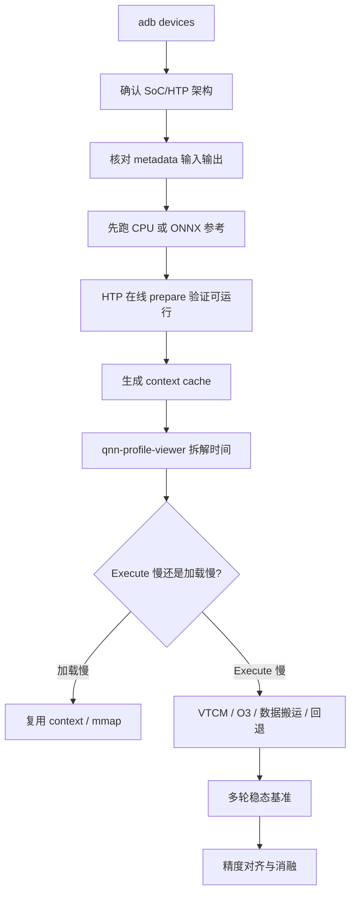

# NAFNet 去模糊一页纸工程报告

> 版本：2026-07-31  
> 范围：NAFNet 原理、ONNX/QNN 运行、SM8850 HTP 优化、验证与调试  
> 当前模型：Qualcomm AI Hub `NAFNet-REDS-width64`，输入 `640×360`

## 1. 一句话结论

NAFNet 用“乘法门控 + 深度卷积 + 简化通道注意力 + U-Net 多尺度信息流”替代复杂激活和注意力，在保持图像复原能力的同时简化算子；端侧部署的决定性优化不是单纯量化或 `burst`，而是**最大 VTCM + O3 离线图优化 + context cache**。

## 2. 它解决什么问题

运动模糊可写成：

$$B=\mathcal{K}(S)+N$$

- `S`：未知清晰图；`B`：观测到的模糊图；`K`：空间变化运动模糊；`N`：噪声、压缩和 ISP 误差。
- 难点：信息已经在曝光期间混合甚至丢失，同一模糊图可能对应多个清晰解释。
- 当前 checkpoint 来自 REDS，目标包含运动模糊与 JPEG 伪影，不应误认为 GoPro 权重。

## 3. 网络原理


一个 NAFBlock 的主干：

1. `LayerNorm2d`；
2. `1×1 Conv` 扩通道；
3. `3×3 Depthwise Conv` 提取空间信息；
4. `SimpleGate`：通道一分为二后逐元素相乘；
5. `SCA`：全局平均池化得到通道权重；
6. `1×1 Conv` 投影回原通道；
7. 两条带可学习缩放 `β/γ` 的残差支路。

“无激活”不等于线性：`x₁×x₂` 本身就是二次非线性，同时比 Sigmoid/GELU 更容易映射到卷积加速器。

## 4. 当前模型接口

| 格式 | 输入 | 输出 | 大小/精度 |
|---|---|---|---|
| ONNX float | NCHW float32 `[1,3,360,640]` | NCHW float32 | 约 67.89M 参数 |
| QNN DLC float | NHWC float32 `[1,360,640,3]` | NHWC float32 | DLC 约 260 MiB |
| QNN DLC w8a16 | NHWC uint16 | NHWC uint16 | DLC 约 75 MiB |

- DLC 生成 QAIRT：`2.45.0.260326154327`。
- 设备运行 QAIRT：`2.47.0.260601`。
- 手机：Xiaomi `2512BPNDAC`，SM8850，HTP v81，Android 16。

## 5. 一键运行

### ONNX

```bash
cd /media/code/tools/naf/nafnet_deblur-onnx-float
python3 inference.py input.jpg -o output.png --provider cpu
```

### QNN float

```bash
cd /media/code/tools/naf/nafnet_deblur-qnn_dlc-float
./run_on_device.sh input.jpg output_float.png htp
```

### QNN w8a16

```bash
cd /media/code/tools/naf/nafnet_deblur-qnn_dlc-w8a16
NUM_INFERENCES=50 ./run_on_device.sh \
  /media/code/tools/naf/nafnet_deblur-onnx-float/input.jpg \
  output_w8a16.png
```

首次运行生成 optimized context，后续复用；模型或 SDK 改变时设置 `REBUILD_CONTEXT=1`。

## 6. 性能结论

HTP accelerator 平均延迟：

| 配置 | w8a16 | 结论 |
|---|---:|---|
| 默认 4 MB VTCM | 327.597 ms | 严重受片外内存搬运影响 |
| 仅 `burst` | 327.558 ms | 几乎无效，频率不是主瓶颈 |
| 原生 uint16 I/O | 327.253 ms | I/O 转换不是主瓶颈 |
| 最大 VTCM | 64.619 ms | 最大单项收益，约 5.1× |
| 最大 VTCM + shared buffer | 62.916 ms | 小幅降低 I/O 开销 |
| 最大 VTCM + O3 + shared buffer | **43.819 ms** | 最佳，整体约 7.48× |

同配置 float 为 **49.192 ms**；w8a16 比 float 快约 12.3%。当前 SM8850 的 `vtcm_mb=0` 最终解析为 **8 MB VTCM**，context 中仍记录约 `61.28 MB` spill/fill buffer。

## 7. 为什么官网约 17 ms 不能直接比较

- 当前页面约 `17 ms` 是 `w8a8` 在 Samsung Galaxy S26 上的数据。
- 当前下载目录模型是 `w8a16`；官网同类数据约 `39.251 ms`。
- 本机 w8a16 为 `43.819 ms`，比同精度官网慢约 11.6%，属于接近而非数量级差距。
- 余量可能来自 OEM 固件、内存频率、HTP 驱动、电源策略和统计口径；这是推测，不是已完成归因。

## 8. 正确性验证

- QNN CPU/GPU 与 ONNX 几乎逐元素一致。
- float HTP 相对 ONNX：PSNR `73.85 dB`。
- w8a16 相对 float HTP：MAE `0.001278`，PSNR `54.69 dB`。
- O3 优化前后 w8a16 原生输出逐元素完全相同，说明加速没有改变结果。
- 上述是部署数值一致性，不等于 REDS 数据集最终质量；正式验收仍需 REDS val300 PSNR/SSIM 和真实手机样本。

## 9. 调试顺序



优先看：模型精度是否匹配、是否全图落在 NPU、VTCM 大小、O3 是否写入 context、HVX 线程数、是否把一次性准备时间误当推理时间。

## 10. 事实、推测、建议

- **事实：**最大 VTCM 是 8 MB；O3 context 使用 8 个 HVX 线程；最佳 w8a16 accelerator 为 43.819 ms。
- **推测：**NAFNet 在当前分辨率主要受中间特征的内存带宽与分块策略限制。
- **建议：**后续优先获得真正 `w8a8` DLC、做 REDS 全集精度验证、记录温度/频率，并用同一设备和同一统计口径比较模型版本。

## 11. 证据入口

- 原始源码：`/media/code/tools/naf/NAFNet`
- ONNX 工程：`/media/code/tools/naf/nafnet_deblur-onnx-float`
- float DLC：`/media/code/tools/naf/nafnet_deblur-qnn_dlc-float`
- w8a16 DLC：`/media/code/tools/naf/nafnet_deblur-qnn_dlc-w8a16`
- w8a16 消融：`benchmark_results.json`
- context 元数据：`context_maxvtcm_o3_info.json`
- 原设计逆向：`nafnet_deblur-onnx-float/docs/NAFNET_ONNX_DESIGN_ANALYSIS.md`
