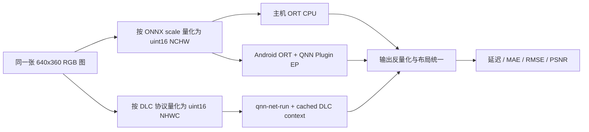
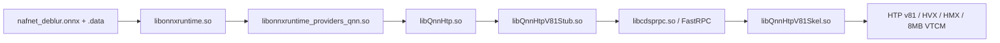
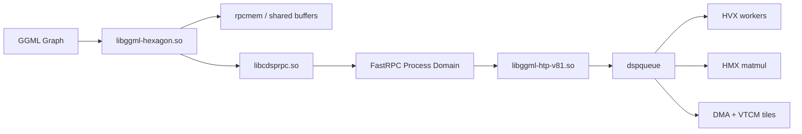
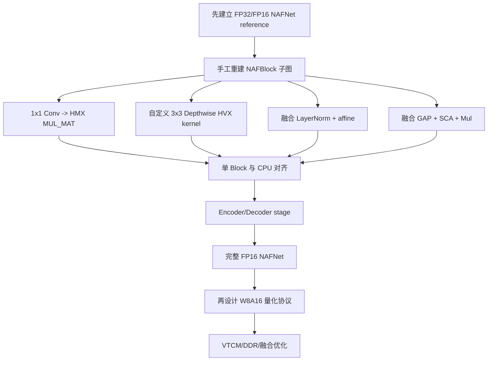

# NAFNet ONNX w8a16 性能与直连 HTP 可行性报告

> 日期：2026-07-31  
> 设备：Xiaomi 2512BPNDAC / SM8850 / Android 16 / HTP v81  
> 模型：`/media/code/tools/naf/nafnet_deblur-onnx-w8a16`  
> 直连 HTP 参考：`/media/code/llm/llama/llama.cpp/ggml/src/ggml-hexagon/htp`

## 0. 结论先行

### 0.1 ONNX w8a16 实测结果

| 路径 | 口径 | 平均延迟 | 中位数 | 最小值 | 吞吐 |
|---|---:|---:|---:|---:|---:|
| 主机 ONNX Runtime CPU | 24 线程，5 次 | 2180.27 ms | 2083.53 ms | 1975.96 ms | 0.46 FPS |
| Android ORT QNN EP，带 basic profiler | 50 次 | 52.25 ms | 52.26 ms | 49.31 ms | 19.14 FPS |
| Android ORT QNN EP，关闭 profiler | 50 次 | 46.76 ms | 46.12 ms | 45.69 ms | 21.39 FPS |
| Android ORT QNN EP，增加动态 burst/RPC 参数 | 30 次 | **45.88 ms** | **45.86 ms** | **45.72 ms** | **21.80 FPS** |
| w8a16 DLC `qnn-net-run` 参考 | NetRun 平均 | 44.74 ms | - | - | 22.35 FPS |
| w8a16 DLC `qnn-net-run` 参考 | HTP accelerator 平均 | 43.82 ms | - | - | 22.82 FPS |

最终可复现的 ONNX 路径是：

- ONNX Runtime QNN EP 2.4.0。
- ONNX Runtime Android 1.24.3。
- QAIRT/QNN 2.47.0。
- 使用 `libQnnHtp.so` 的**绝对路径**。
- 使用最大 VTCM 8 MB、O3、burst、HTP shared-memory allocator。
- 运行时增加 `qnn.perf_mode=burst` 和 `qnn.rpc_control_latency=100`。
- 强制 `session.disable_cpu_ep_fallback=1` 后仍可运行，证明不是 CPU 混跑。

核心结论：

1. **事实**：ONNX w8a16 已在手机 HTP 上完整跑通，最佳稳定结果为平均 45.88 ms。
2. **事实**：相对主机 CPU 快 47.5 倍。
3. **事实**：相对同一设备上的优化 DLC，端到端只慢 1.13 ms，约 2.53%。
4. **事实**：带 profiler 会增加约 6.37 ms 的端到端开销，因此 profiler 结果不能代表产品延迟。
5. **事实**：ONNX 在线编译/Finalize 很慢，Session 初始化约 54 秒，其中 QNN Finalize 实测约 45.49 秒。
6. **建议**：产品化时必须生成并部署 QNN EP context cache，不能每次启动都从 3617 节点 QDQ 图在线编译。

### 0.2 直连 HTP 的结论

1. **事实**：`ggml-hexagon` 的直连 HTP backend 已在该手机真实运行，不依赖 QNN backend。
2. **事实**：运行时识别到 HTP v81、8 个 HVX 线程、1 个 HMX、最大 VTCM 8 MB。
3. **事实**：FP16 `MUL_MAT` 正确性测试为 **270/270 通过**。
4. **事实**：这个 backend 接收 GGML graph，不接收 ONNX，也不接收 DLC。
5. **结论**：可以用它“直接驱动 HTP”，但**不能把 NAFNet ONNX 直接交给它运行**。
6. **建议**：生产部署继续使用 QNN DLC 或 ORT QNN EP；只有在需要自定义算子、特殊融合或完全掌控 kernel 时，才值得开发 NAFNet 的直连 HTP backend。

---

## 1. 阅读约定

本文将结论分为三类：

- **事实**：由本地文件、设备输出、profiler 或正确性测试直接证明。
- **推测**：基于代码结构和实验现象的工程推断，还需要额外实验验证。
- **建议**：面向后续产品化或研发投入的决策建议。

---

## 2. 环境与版本

### 2.1 设备

| 项目 | 值 |
|---|---|
| adb serial | `c495c2c3` |
| 设备型号 | `2512BPNDAC` |
| SoC | `SM8850` |
| Android | 16 |
| HTP 架构 | v81 |
| HVX 线程 | 8 |
| HMX | 1 |
| 最大 VTCM | **8 MB** |
| 基准结束后的电池温度 | 28.9°C |

### 2.2 软件

| 组件 | 版本 |
|---|---|
| 模型生成 QAIRT | `2.45.0.260326154327` |
| 本机 QAIRT | `2.47.0.260601` |
| 主机 ONNX Runtime | 1.26.0 |
| Android ONNX Runtime | 1.24.3 |
| Android QNN Plugin EP | 2.4.0 |
| Android NDK | 27.0.12077973 |
| Hexagon SDK | 6.6.0.0 |

QNN EP 2.4.0 的 Android 文档验证组合是 ORT Android 1.24.3 和 QNN Runtime 2.45.0。本次设备只有 QNN 2.47.0，因此 runner 使用了：

```text
skip_qnn_version_check=1
```

这不是“无条件兼容”的证明，只是本次模型、设备和接口组合经过实际运行验证。

### 2.3 模型哈希

```text
48c5ae6afff38988efe88c1275bce704d025d729762f75e095ec9434a1ae12c5  nafnet_deblur.onnx
742aaccef608e9f4380dbb940994498dc0c50ca4bb9938b89e0109513321d004  nafnet_deblur.data
```

---

## 3. ONNX w8a16 模型规格

### 3.1 I/O 协议

| Tensor | Shape | Layout | Dtype | Scale | Zero point |
|---|---|---|---|---:|---:|
| `image` | `[1,3,360,640]` | NCHW | uint16 | 1.5259021893143654e-05 | 0 |
| `deblurred_image` | `[1,3,360,640]` | NCHW | uint16 | 1.9742114091059193e-05 | 8480 |

注意：DLC 的原生 I/O 是 NHWC，而 ONNX 是 NCHW。二者 raw 文件不能直接逐元素比较，必须先转置布局。

### 3.2 图规模

| 指标 | 值 |
|---|---:|
| IR version | 9 |
| Opset | 21 |
| 节点数 | 3617 |
| initializer 数 | 2603 |
| 外部权重文件 | 272,800,256 bytes |

### 3.3 算子组成

| 算子 | 数量 |
|---|---:|
| DequantizeLinear | 1549 |
| QuantizeLinear | 1255 |
| Conv | 226 |
| Mul | 180 |
| Transpose | 144 |
| Add | 77 |
| LayerNormalization | 72 |
| Split | 72 |
| GlobalAveragePool | 36 |
| DepthToSpace | 4 |
| Pad | 1 |
| Slice | 1 |

Q/DQ 节点共 2804 个，占总节点数约 77.5%。这解释了在线 QNN graph composition/finalize 时间为什么很长。

### 3.4 卷积类型

| 类型 | 数量 | 直连 HTP 意义 |
|---|---:|---|
| 1x1，group=1 | 184 | 可重写为矩阵乘，最容易映射 |
| 3x3 depthwise，group=128/256/512/1024/2048 | 36 | 需要专用 depthwise kernel 才能高效 |
| 2x2 stride=2 | 4 | 可用 im2col+matmul，但当前 HTP coverage 受限 |
| 普通 3x3 | 2 | 需要 padding + im2col + matmul 或自定义 kernel |

---

## 4. 基准方法



### 4.1 延迟口径

- Session 初始化单独计时。
- Warmup 不计入统计。
- 同一进程连续多次执行。
- profiler 开启和关闭分别测试。
- 最终结果强制禁用 CPU fallback。
- 不把图片解码、resize、保存 PNG 计入模型推理延迟。

### 4.2 正确性口径

- ONNX 输出先保持 NCHW。
- DLC 输出从 NHWC 转成 NCHW。
- uint16 raw 比较用于发现协议或布局错误。
- 反量化后计算 MAE、RMSE 和单位动态范围 PSNR。

---

## 5. 主机 CPU 基线

配置：

- ONNX Runtime 1.26.0。
- `CPUExecutionProvider`。
- 24 个 intra-op 线程。
- 1 次 warmup，5 次统计。

结果：

| 指标 | 值 |
|---|---:|
| Session 初始化 | 453.81 ms |
| 平均 | 2180.27 ms |
| 中位数 | 2083.53 ms |
| 最小 | 1975.96 ms |
| 最大 | 2566.42 ms |

主机 CPU 不是目标部署路径，但它提供了标准 ONNX 数值参考。

---

## 6. Android ORT QNN EP 跑通过程

### 6.1 运行链路



### 6.2 必需文件

Android 工作目录中实际使用：

```text
ort_qnn_android_benchmark
libonnxruntime.so
libonnxruntime_providers_qnn.so
libc++_shared.so
libQnnHtp.so
libQnnHtpV81Stub.so
libQnnHtpPrepare.so
libQnnSystem.so
libQnnHtpV81Skel.so
nafnet_deblur.onnx
nafnet_deblur.data
input_ort_nchw_uint16.raw
```

### 6.3 三个关键坑

#### 坑 1：不要把 `/vendor/lib64` 加到 `LD_LIBRARY_PATH`

错误设置：

```bash
LD_LIBRARY_PATH=$REMOTE:/vendor/lib64
```

在该 Android 16 设备上会让系统 `libandroid.so` 错误链接到 vendor 侧不匹配的图形库，出现 `SurfaceComposerClient::Transaction::setBuffer` 符号缺失。

正确设置：

```bash
export LD_LIBRARY_PATH=$REMOTE
```

系统 linker 自己可以找到系统/vendor 依赖，不要人为改变优先级。

#### 坑 2：`backend_type=htp` 在当前组合下没有形成 HTP 分区

只写：

```text
backend_type=htp
```

Session 初始化约 1-2 秒，推理仍约 2.4 秒，且没有 QNN profiler 输出。这是 CPU fallback，不是 HTP 性能。

本次可工作的配置是：

```text
backend_path=/data/local/tmp/nafnet_ort_qnn_w8a16/libQnnHtp.so
```

即使用绝对路径显式加载 QNN HTP backend。

#### 坑 3：QNN 2.47 与插件验证版本 2.45 不同

不设置兼容开关时，Session 初始化约 1.38 秒，推理退回 2.3-3.5 秒 CPU 路径。

设置：

```text
skip_qnn_version_check=1
```

后 Session 初始化恢复为约 54 秒，推理恢复为约 46 ms，说明 QNN graph 被编译并执行。

**建议**：更稳妥的产品方案是使用与插件完全匹配的 QNN Runtime 2.45.0，而不是长期依赖跳过版本检查。

### 6.4 如何确认真的跑在 HTP

本次使用四层证据：

1. Session 初始化约 54 秒，而 CPU fallback 只需约 1-2 秒。
2. QNN profiler 记录到 8 个 HVX 线程和 HTP accelerator execute。
3. 输出数值与 DLC 高度一致。
4. 设置 `session.disable_cpu_ep_fallback=1` 后 Session 仍成功，单次 45.818 ms。

第 4 条是最强的运行时验收。

---

## 7. Android QNN 性能结果

### 7.1 带 profiler

5 次 warmup，50 次统计：

| 指标 | 值 |
|---|---:|
| ORT 端到端平均 | 52.245 ms |
| ORT 中位数 | 52.258 ms |
| QNN execute 平均 | 47.907 ms |
| RPC execute 平均 | 45.539 ms |
| QNN accelerator 平均 | 44.963 ms |
| accelerator excluding wait | 44.478 ms |
| HVX threads | 8 |

### 7.2 关闭 profiler

5 次 warmup，50 次统计：

| 指标 | 值 |
|---|---:|
| 平均 | 46.758 ms |
| 中位数 | 46.122 ms |
| 最小 | 45.690 ms |
| 最大 | 49.277 ms |

后半段延迟略有上升，可能包含持续 burst 的温控、调度或电源状态波动。该判断是**推测**，因为没有同步采集每次运行对应的频率和温度 trace。

### 7.3 动态 RunOptions 消融

增加：

```text
qnn.perf_mode=burst
qnn.rpc_control_latency=100
```

5 次 warmup，30 次统计：

| 指标 | 值 |
|---|---:|
| 平均 | **45.876 ms** |
| 中位数 | **45.863 ms** |
| 最小 | **45.716 ms** |
| 最大 | **46.500 ms** |
| 标准差 | 0.150 ms |

相对没有动态 RunOptions 的平均值提升：

- 0.882 ms。
- 1.92%。
- 稳定性明显更好。

### 7.4 与 DLC 对比

| 指标 | ORT QNN EP | DLC `qnn-net-run` | 差值 |
|---|---:|---:|---:|
| 最佳端到端平均 | 45.876 ms | 44.742 ms | +1.134 ms / +2.53% |
| HTP accelerator 平均 | 44.963 ms | 43.819 ms | +1.144 ms / +2.61% |

结论：在推理稳态下，ORT QNN EP 已非常接近 DLC。主要差异不在 HTP kernel 本身，而在 ORT/QNN glue、RPC 控制和 I/O 管理。

### 7.5 为什么官网 17 ms 没达到

45.876 ms 是 17 ms 的约 2.70 倍。二者不能直接视为同一口径，可能差在：

- 测试设备和 SoC。
- AI Hub 选择的 runtime/profile。
- HTP 固件和系统版本。
- 是否包含框架、RPC、I/O 或同步。
- 是否使用离线 context、特殊内存和实验室电源模式。
- AI Hub 数据使用的模型变体或编译器版本。

**事实**：本报告中的 45.876 ms 是当前这台 SM8850 手机上、当前软件栈、固定 640x360 输入和真实 Android 运行时的可复现实测。

**建议**：官网数字只作为上界线索。判断本地优化是否有效，应比较同设备、同模型、同输入、同计时边界下的消融结果。

---

## 8. Session 初始化与 context cache

### 8.1 实测

| 指标 | 值 |
|---|---:|
| Plugin/Environment 初始化 | 约 60 ms |
| ORT Session 初始化 | 53.75-62.33 s |
| QNN Finalize | 45.486 s |
| QNN accelerator Finalize | 115.7 ms |

大部分时间消耗在主机侧 QNN graph 编译和优化，而不是 HTP 加载。

### 8.2 产品化建议

启用：

```text
ep.context_enable=1
ep.context_file_path=/path/to/nafnet_w8a16_ctx.onnx
ep.context_embed_mode=0
```

首次部署或构建阶段生成 context ONNX + QNN binary，产品运行时加载 context 模型。目标是把 54 秒在线编译从用户启动路径中移除。

本次没有把 context cache 生成纳入最终基准，因此这里是**建议**，不是已测量结果。

---

## 9. 正确性验证

### 9.1 ORT QNN EP 与 ORT CPU

| 指标 | 值 |
|---|---:|
| uint16 MAE | 11.679 LSB |
| uint16 最大绝对误差 | 319 LSB |
| 反量化 MAE | 0.0002306 |
| 反量化 RMSE | 0.0003240 |
| 单位动态范围 PSNR | 69.79 dB |

### 9.2 ORT QNN EP 与 QNN DLC

| 指标 | 值 |
|---|---:|
| uint16 MAE | 6.000 LSB |
| uint16 最大绝对误差 | 81 LSB |
| 反量化 MAE | 0.0001184 |
| 反量化 RMSE | 0.0001621 |
| 单位动态范围 PSNR | 75.81 dB |

### 9.3 优化是否改变输出

带 profiler、关闭 profiler、动态 RunOptions 三条 HTP 路径的输出逐元素完全相同：

```text
exact fraction = 1.0
max absolute error = 0
```

这证明本次性能参数没有改变模型数值结果。

---

## 10. 直连 HTP backend 实际验证

### 10.1 它不是 QNN

参考实现由两部分组成：

- Android/CPU 侧：`libggml-hexagon.so`。
- HTP 侧：`libggml-htp-v81.so`。

CPU 侧直接加载 `libcdsprpc.so`，通过 FastRPC 和 `htp_iface.idl` 调用 HTP shared library。算子在 `htp/*.c` 中以 HVX/HMX/DMA kernel 实现。



运行时实测：

```text
Hexagon Arch version v81
threads 8, hvx 8, hmx 1, vtcm 8 MB
URI file:///libggml-htp-v81.so?...&_dom=nsp1000
```

### 10.2 正确性测试

命令：

```bash
adb -s c495c2c3 shell '
  cd /data/local/tmp/llama.cpp &&
  LD_LIBRARY_PATH=/data/local/tmp/llama.cpp/lib \
  ADSP_LIBRARY_PATH=/data/local/tmp/llama.cpp/lib \
  ./bin/test-backend-ops -b HTP0 -o MUL_MAT -p "type_a=f16"
'
```

结果：

```text
270/270 tests passed
Backend HTP0: OK
2/2 backends passed
```

这证明：

- FastRPC session 可创建。
- v81 HTP library 可加载。
- shared memory mapping 可用。
- HTP queue 可提交和同步。
- FP16 matmul 的多种 shape/batch/view 组合与 CPU 参考一致。

---

## 11. 直连 HTP 对 NAFNet 的算子覆盖

### 11.1 当前 GGML Hexagon 可见算子

当前代码包含：

- `MUL_MAT`、`MUL_MAT_ID`。
- `ADD`、`MUL`、`SUB`、`DIV`。
- `NORM`、`RMS_NORM`、`L2_NORM`。
- `IM2COL`、`PAD`。
- `SUM_ROWS`、`SCALE`、`CONCAT`。
- `RESHAPE`、`VIEW`、`PERMUTE`、`TRANSPOSE`、`CONT` 等图操作。
- softmax、RoPE、FlashAttention、SSM Conv 等 LLM 相关 kernel。

它没有通用的 `CONV2D`、`DEPTHWISE_CONV2D`、`GLOBAL_AVERAGE_POOL` 或 `DEPTH_TO_SPACE` HTP op。

### 11.2 设备 support probe

对 NAFNet 相关 GGML op 运行 support probe：

| GGML op | 支持/总数 | 说明 |
|---|---:|---|
| NORM | 30/30 | 仅测试矩阵中的 F32 组合 |
| PAD | 28/28 | 仅测试矩阵中的 F32 组合 |
| ADD | 66/90 | 广播、布局和类型有限制 |
| MUL | 66/90 | 广播、布局和类型有限制 |
| SUM_ROWS | 4/10 | 非连续/permute/slice 情况受限 |
| IM2COL | **0/91** | 当前测试集全部不支持 |

`IM2COL` 当前只接受 2D、连续 F32 输入、F32/F16 输出，并且明确拒绝 padding。NAFNet 的 36 个 3x3 depthwise conv 和普通 3x3 conv 都使用 padding，所以不能直接复用现有路径。

---

## 12. NAFNet 直连 HTP 缺口矩阵

| ONNX 结构 | 数量 | 可复用基础 | 缺口 | 风险 |
|---|---:|---|---|---|
| Q/DQ uint16 | 2804 | 无等价 UFIXED16 图协议 | importer、量化参数传播、定点 kernel | 极高 |
| 1x1 Conv | 184 | MUL_MAT/HMX | 权重布局、空间维展开、bias、融合 | 中 |
| 3x3 depthwise Conv | 35 | 当前无高效路径 | 专用 depthwise HVX kernel | 极高 |
| 2x2 stride2 Conv | 4 | IM2COL + MUL_MAT 理论可用 | 现有 IM2COL coverage、量化、layout | 高 |
| 普通 3x3 Conv | 2 | IM2COL + MUL_MAT 理论可用 | padding 被拒绝 | 高 |
| LayerNormalization | 72 | F32 NORM | NHWC channel norm、affine、F16/量化、融合 | 高 |
| Split | 72 | VIEW 可表达 | importer 和生命周期管理 | 低到中 |
| GlobalAveragePool | 36 | SUM_ROWS + SCALE | 布局与连续性限制 | 中 |
| DepthToSpace | 4 | reshape/permute/cont 可组合 | 专用 lowering、可能的拷贝 | 中 |
| Transpose | 144 | PERMUTE/TRANSPOSE | 下游 kernel layout 接受能力 | 高 |
| Pad/Slice | 2 | PAD/VIEW | 非对称边界与 layout | 中 |

### 12.1 最大障碍不是“缺少一个算子”

真正的工作包括：

1. 读取 ONNX 和外部权重。
2. 把 NCHW/NHWC、stride、padding、group、量化轴映射到 GGML tensor。
3. 将 3617 个 ONNX 节点重写成较小的融合 GGML graph。
4. 设计 uint16 activation + int8/其他 weight 的定点计算协议。
5. 为 depthwise conv、LayerNorm 和 SCA 路径写 kernel。
6. 做全图内存规划、buffer 复用和 VTCM tiling。
7. 做跨算子融合，避免 640x360 feature map 反复读写 DDR。
8. 建立逐层、逐块和端到端数值验证。
9. 针对 HTP v81 做 HMX/HVX 调度和多线程负载均衡。

QNN 的价值主要就在第 3-9 项，而不只是“调用 HTP”。

---

## 13. 如果一定要直连 HTP，建议的实现路线



### 阶段 A：FP32/FP16 功能原型

- 不直接搬 2804 个 Q/DQ 节点。
- 从 NAFNet 原始结构重建 graph。
- 先实现 1 个 NAFBlock。
- 输入输出与 PyTorch/ONNX 对齐。

### 阶段 B：关键 kernel

- 1x1 Conv 使用 HMX matmul。
- 新增 3x3 depthwise HVX kernel。
- 新增 channels-last LayerNorm + affine 融合。
- 新增 GAP + SCA 融合。
- DepthToSpace 尽量做 view/permute，避免完整拷贝。

### 阶段 C：W8A16

- 定义 activation scale/zero-point 的传播规则。
- 权重 per-channel quantization。
- 处理 residual 两路 scale 对齐。
- 避免每个算子边界都物理 Q/DQ。

### 阶段 D：性能

- 以 stage 为单位做 buffer reuse。
- 将高频 feature map 留在共享 buffer。
- 使用 VTCM 保存 tile 和临时量化数据。
- 将 LayerNorm、SimpleGate、SCA、Mul、Add 融合。

---

## 14. 是否值得绕过 QNN

| 目标 | QNN DLC | ORT QNN EP | 直连 HTP |
|---|---|---|---|
| 当前性能 | **44.74 ms** | **45.88 ms** | NAFNet 尚不可运行 |
| 启动 | cached context 快 | 原始 ONNX 约 54 s，需 context cache | 自行实现 |
| ONNX 兼容 | 需转换 | 最好 | 无 importer |
| 算子覆盖 | 高 | 高 | 主要偏 LLM |
| 自定义 kernel | 受框架限制 | 受框架限制 | 最自由 |
| 工程风险 | 低 | 中 | 极高 |
| 维护成本 | 低到中 | 中 | 极高 |

### 决策

- **建议 1**：追求产品交付，继续使用 DLC cached context。
- **建议 2**：需要保留 ONNX 作为部署入口，使用 ORT QNN EP + context cache。
- **建议 3**：只有以下条件同时满足时才投入直连 HTP：
  - QNN 无法表达关键自定义算子或融合。
  - 现有 44-46 ms 明显无法满足产品目标。
  - 有熟悉 Hexagon SDK、HVX/HMX、FastRPC 和量化 kernel 的长期维护人员。
  - 能承担数月级工程和跨系统版本维护。

### 粗略工作量推测

- CPU/GGML 混合功能原型：1-2 周。
- 纯 HTP FP16 且结果正确：约 1-2 个月。
- W8A16、融合、VTCM、稳定性接近 QNN：多月级专项。

这些是**工程推测**，不是排期承诺；最终取决于现有团队对 Hexagon kernel 和图编译的熟悉程度。

---

## 15. 可复现命令

### 15.1 主机 CPU

```bash
cd /media/code/tools/naf/nafnet_deblur-onnx-w8a16
./benchmark_ort.py \
  /media/code/tools/naf/nafnet_deblur-qnn_dlc-w8a16/.qnn_work/input_640x360.png \
  --qnn-output /media/code/tools/naf/nafnet_deblur-qnn_dlc-w8a16/results/bench_maxvtcm_o3_native_shared_50/Result_0/deblurred_image_native.raw \
  --warmup 1 --runs 5 --threads 24
```

### 15.2 构建 Android runner

```bash
NDK=/media/ext/opt/Android/Sdk/ndk/27.0.12077973
CXX=$NDK/toolchains/llvm/prebuilt/linux-x86_64/bin/aarch64-linux-android26-clang++

$CXX -std=c++17 -O3 -fPIE -pie \
  -I/path/to/onnxruntime-android-1.24.3/headers \
  ort_qnn_android_benchmark.cpp \
  -L/path/to/onnxruntime-android-1.24.3/jni/arm64-v8a \
  -lonnxruntime -Wl,-rpath,'$ORIGIN' \
  -o ort_qnn_android_benchmark
```

### 15.3 Android 运行

```bash
REMOTE=/data/local/tmp/nafnet_ort_qnn_w8a16

adb -s c495c2c3 shell "
  cd $REMOTE &&
  export LD_LIBRARY_PATH=$REMOTE &&
  export ADSP_LIBRARY_PATH='$REMOTE;/vendor/dsp/cdsp;/vendor/lib/rfsa/adsp;/system/lib/rfsa/adsp;/dsp' &&
  ./ort_qnn_android_benchmark \
    nafnet_deblur.onnx \
    input_ort_nchw_uint16.raw \
    output_ort_qnn.raw \
    $REMOTE/libonnxruntime_providers_qnn.so \
    $REMOTE/libQnnHtp.so \
    - 5 30
"
```

`-` 表示关闭 QNN profiler；传入 CSV 路径则开启 basic profiler。

---

## 16. 事实、推测与建议汇总

### 16.1 事实

- ONNX w8a16 可在当前手机纯 HTP 路径运行。
- 最佳平均延迟 45.876 ms。
- 禁用 CPU fallback 后仍成功。
- 最大 VTCM 为 8 MB。
- QNN profiler 显示 8 个 HVX 线程。
- Session 在线编译约 54 秒。
- ORT QNN 与 DLC 输出 PSNR 75.81 dB。
- ggml 直连 HTP 的 FP16 matmul 270/270 通过。
- 直连 backend 的 IM2COL 当前 probe 为 0/91 支持。

### 16.2 推测

- 关闭 profiler 的 50 次测试后半段变慢可能与热状态或电源调度有关。
- ORT 相对 DLC 的约 1 ms 差异主要来自框架、RPC 和 I/O glue。
- 若重写专用 depthwise/LayerNorm/SCA 融合 kernel，直连 HTP 有机会超过通用 QNN 图，但不保证超过成熟 QNN compiler。

### 16.3 建议

- 生产优先 DLC cached context。
- ONNX 部署使用 ORT QNN EP context cache。
- 使用绝对 `backend_path`。
- 尽量匹配插件验证过的 QNN Runtime 版本。
- 基准时强制禁用 CPU fallback。
- 产品延迟关闭 profiler 后再测。
- 直连 HTP 先做一个 NAFBlock，不要一开始就迁移完整 3617 节点 QDQ 图。

---

## 17. 原始证据与产物

### ONNX 目录

```text
/media/code/tools/naf/nafnet_deblur-onnx-w8a16/benchmark_ort.py
/media/code/tools/naf/nafnet_deblur-onnx-w8a16/benchmark_ort_cpu.json
/media/code/tools/naf/nafnet_deblur-onnx-w8a16/model_structure_analysis.json
/media/code/tools/naf/nafnet_deblur-onnx-w8a16/ort_qnn_android_benchmark.cpp
/media/code/tools/naf/nafnet_deblur-onnx-w8a16/android_qnn_ep_results/benchmark_android_qnn_ep.json
/media/code/tools/naf/nafnet_deblur-onnx-w8a16/android_qnn_ep_results/qnn_profile_50.csv
/media/code/tools/naf/nafnet_deblur-onnx-w8a16/android_qnn_ep_results/qnn_profile_50_summary.json
/media/code/tools/naf/nafnet_deblur-onnx-w8a16/android_qnn_ep_results/output_comparison.json
```

### 直连 HTP 证据

```text
/media/code/tools/naf/nafnet_deblur-onnx-w8a16/direct_htp_mul_mat_f16_test.clean.log
/media/code/tools/naf/nafnet_deblur-onnx-w8a16/direct_htp_required_ops_support.csv
/media/code/tools/naf/nafnet_deblur-onnx-w8a16/direct_htp_required_ops_support_summary.json
```

### 相关代码

```text
/media/code/llm/llama/llama.cpp/ggml/src/ggml-hexagon/ggml-hexagon.cpp
/media/code/llm/llama/llama.cpp/ggml/src/ggml-hexagon/htp-drv.cpp
/media/code/llm/llama/llama.cpp/ggml/src/ggml-hexagon/htp/main.c
/media/code/llm/llama/llama.cpp/ggml/src/ggml-hexagon/htp/matmul-ops.c
/media/code/llm/llama/llama.cpp/ggml/src/ggml-hexagon/htp/im2col-ops.c
/media/code/llm/llama/llama.cpp/ggml/src/ggml-hexagon/htp/unary-ops.c
```

### 官方参考

- Qualcomm AI Hub NAFNet-DeBlur：`https://aihub.qualcomm.com/models/nafnet_deblur`
- ONNX Runtime QNN Plugin EP 2.4.0：`https://github.com/onnxruntime/onnxruntime-qnn/blob/v2.4.0/docs/execution_providers/QNN-ExecutionProvider.md`

---

## 18. 最终判断

### Task 1

`nafnet_deblur-onnx-w8a16` 已完整跑通。当前设备上可复现的最佳产品态推理结果是：

```text
45.876 ms average
45.863 ms median
45.716 ms minimum
21.80 FPS
```

相对 DLC 只慢约 2.53%，但原始 ONNX Session 初始化约 54 秒，因此必须增加 context cache。

### Task 2

“不使用 QNN、直接使用 HTP backend”在基础设施层面已经验证可行：FastRPC、v81 HTP library、HVX/HMX、VTCM 和 FP16 matmul 都能工作。

但对 NAFNet 来说，当前实现仍缺少 ONNX importer、W8A16 量化协议、depthwise conv、padded im2col、channels-last LayerNorm、GAP、DepthToSpace 和全图融合/内存规划。因此：

> **直连 HTP 通路能跑；NAFNet 不能直接跑。要跑起来，需要开发一个面向 NAFNet 的图 lowering 与 kernel backend，而不是换一个命令行参数。**
