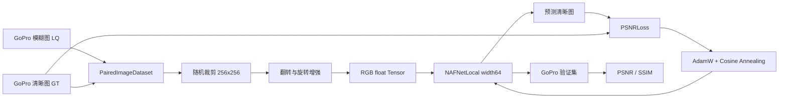
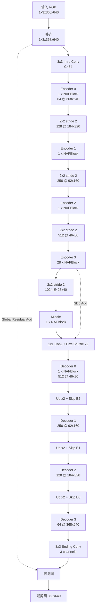
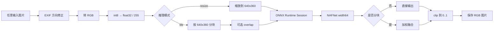
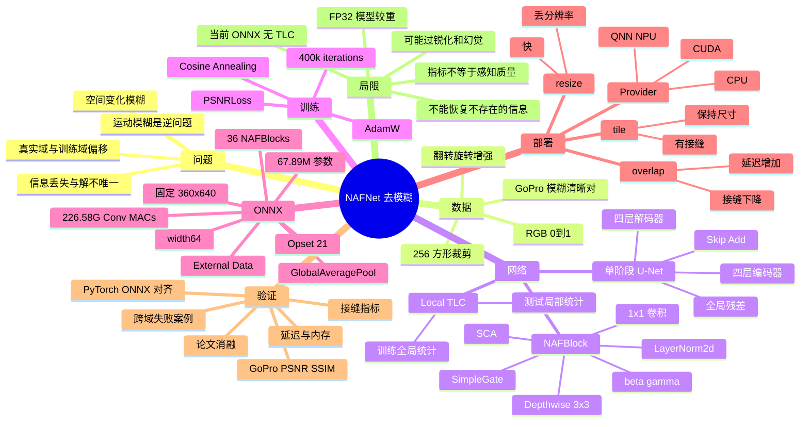
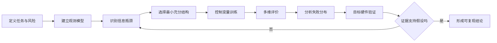
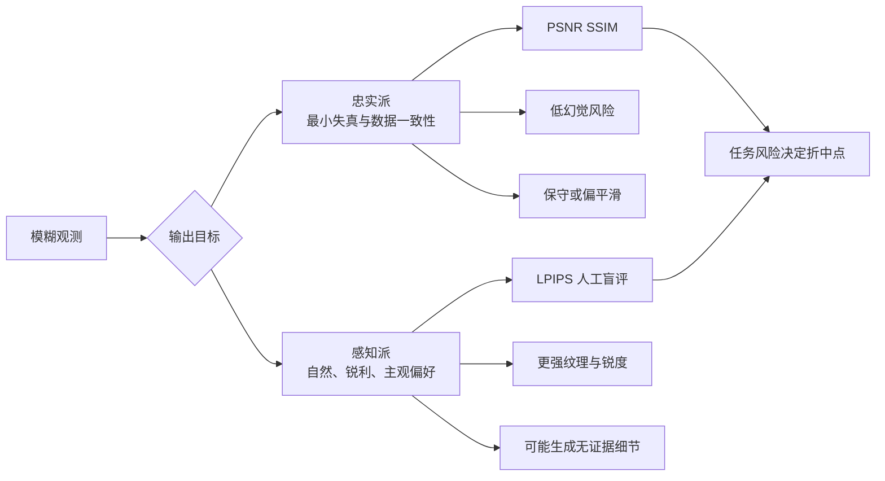

# NAFNet 项目与 `nafnet_deblur.onnx` 逆向设计分析

> 文档日期：2026-07-31  
> 分析范围：`/media/code/tools/naf/NAFNet` 源码项目、当前目录的 `nafnet_deblur.onnx` 与 `nafnet_deblur.data`、本机 ONNX Runtime 实测、论文 *Simple Baselines for Image Restoration*。  
> 目标：回答“解决什么问题、为什么有效、项目如何设计、ONNX 如何落地、证据是否充分、代价与局限是什么”。

## 0. 阅读约定：事实、推测、建议分开

本文使用以下标签，避免把合理猜测写成已证实结论：

| 标签            | 含义                                       | 判定标准                         |
| --------------- | ------------------------------------------ | -------------------------------- |
| [事实-源码] | 本地 PyTorch 项目中可直接定位              | 有具体源码或配置位置             |
| [事实-ONNX] | 从 ONNX 图、权重或运行结果直接得到         | 可由模型解析或本机复现           |
| [事实-论文] | ECCV 2022 论文报告                         | 论文表格或正文直接给出           |
| [事实-本测] | 2026-07-31 在当前机器完成的实验            | 只代表本机、该样例和当前软件版本 |
| [推测]      | 证据支持但缺少导出脚本、权重来源或对照数据 | 必须进一步实验才能确认           |
| [建议]      | 工程或验证建议                             | 不等于当前实现已经具备           |

最重要的证据边界：

1. [事实-ONNX] 当前 ONNX 的结构与 `NAFNet-GoPro-width64` 的宽度、块数和参数量完全吻合。
2. [事实-ONNX] ONNX 图中存在 36 个 `GlobalAveragePool`，没有源码 `NAFNetLocal` 使用的局部平均池化计算图。
3. [推测] ONNX 很可能由普通 `NAFNet` 或未启用 TLC 转换的模型导出，但目录中没有导出脚本和原始 `.pth`，因此不能断言权重与某个官方 checkpoint 逐元素相同。
4. [事实-论文] 论文和源码仓库报告的 GoPro 指标是 PyTorch/checkpoint 结果；不能直接继承为当前 ONNX 的实测指标。

---

## 1. 执行摘要

### 1.1 它解决了什么问题

[事实-源码] `NAFNet` 项目是通用图像复原框架，覆盖：

- GoPro 动态场景运动去模糊；
- SIDD 图像去噪；
- REDS 带 JPEG 伪影的去模糊；
- NAFSSR 双目超分辨率。

[事实-ONNX] 当前 `nafnet_deblur.onnx` 只暴露一个去模糊接口：

- 输入：`image`，`float32`，`[1, 3, 360, 640]`；
- 输出：`deblurred_image`，`float32`，`[1, 3, 360, 640]`；
- 输入语义：RGB、值域 `[0, 1]`；
- 输出语义：恢复后的 RGB 图像，部署脚本需要裁剪到 `[0, 1]` 后保存。

### 1.2 核心结论

- [事实-源码] 网络是单阶段、四层编码器/解码器 U-Net，使用跨层跳连和全局图像残差。
- [事实-源码] NAFBlock 不使用 ReLU、GELU、Sigmoid、Softmax 等传统激活；非线性由通道拆分后的逐元素乘法 `SimpleGate` 提供。
- [事实-论文] 论文消融显示：从 PlainNet 到 Baseline，再移除/简化非线性得到 NAFNet，GoPro PSNR 从 `32.83 dB` 提升到 `33.69 dB`。
- [事实-ONNX] 当前模型是 `width=64`、共 36 个 NAFBlock、约 `67.89M` 浮点参数；权重约 `259 MiB`。
- [事实-ONNX] 固定 360p 输入实际先在高度方向补到 `368`，以满足四次 2 倍下采样要求，最后再裁回 `360`。
- [事实-本测] 单次 640×360 CPU 推理约 `1.5 s`；1280×720 分块推理约 `4.8 s`，加入 32 像素重叠融合约 `9.5 s`。
- [事实-本测] 无重叠分块出现明显横向接缝；32 像素重叠把边界跳变相对邻域中位数从 `4.92×` 降到 `1.27×`。
- [建议] 若目标是证明“模型效果达到论文水平”，必须补做 GoPro 带 GT 的 PSNR/SSIM 测试和 PyTorch→ONNX 数值一致性测试。

---

## 2. 第一性原理：为什么去模糊是一个难问题

### 2.1 观测模型

运动模糊可以抽象为：

$$
B = \mathcal{K}(S) + N
$$
- `S`：希望恢复的清晰图像；
- `B`：相机真正记录到的模糊图像；
- `K`：曝光期间由相机抖动、物体运动、深度变化共同形成的空间变化模糊过程；
- `N`：传感器噪声、压缩误差、量化误差。

### 2.2 根本困难

1. 信息折叠：多个清晰像素在曝光期间混合到同一观测中。
2. 解不唯一：不同清晰场景可能产生非常相近的模糊图像。
3. 模糊空间变化：人的运动、背景和相机抖动不是同一个卷积核。
4. 细节与稳定性的冲突：锐化过弱没有效果，过强会产生振铃、双边、假纹理。
5. 训练与真实世界错位：GoPro 合成/采集分布不能覆盖所有失焦、夜景、滚动快门和压缩场景。

因此，网络不是把一个确定公式“求逆”，而是从大量模糊/清晰图像对中学习自然图像先验：什么样的边缘、纹理和结构更可能是清晰图像。

### 2.3 设计约束推导

从问题本身可以推导出五个需求：

| 第一性需求                            | 对应设计                               |
| ------------------------------------- | -------------------------------------- |
| 同时理解大范围运动和局部边缘          | 多尺度 U-Net                           |
| 保留原图低频内容，只改需要修正的部分  | 全局残差 `output = correction + input` |
| 在较低成本下扩大感受野                | 下采样后堆叠深层块、深度卷积           |
| 让不同通道根据图像内容自适应放大/抑制 | SCA 通道注意力                         |
| 深网络训练起点稳定                    | `beta/gamma=0` 的残差缩放              |

---

## 3. 项目拆解

### 3.1 代码职责地图

| 模块               | 作用                                              | 关键位置                                                     |
| ------------------ | ------------------------------------------------- | ------------------------------------------------------------ |
| 网络主体           | `SimpleGate`、`NAFBlock`、`NAFNet`、`NAFNetLocal` | `/media/code/tools/naf/NAFNet/basicsr/models/archs/NAFNet_arch.py:22` |
| Baseline 演化起点  | GELU、通道注意力、FFN、U-Net 主干                 | `/media/code/tools/naf/NAFNet/basicsr/models/archs/Baseline_arch.py:20` |
| TLC/Local 推理     | 将全局池化替换为局部平均池化                      | `/media/code/tools/naf/NAFNet/basicsr/models/archs/local_arch.py:10` |
| 图像复原训练壳     | 网络创建、权重加载、优化、验证、网格切分          | `/media/code/tools/naf/NAFNet/basicsr/models/image_restoration_model.py:23` |
| 数据集             | 模糊/清晰配对、裁剪、翻转、旋转、RGB Tensor       | `/media/code/tools/naf/NAFNet/basicsr/data/paired_image_dataset.py:20` |
| 损失函数           | `PSNRLoss`                                        | `/media/code/tools/naf/NAFNet/basicsr/models/losses/losses.py:90` |
| GoPro width64 配置 | 网络宽度、块数、优化器、训练步数                  | `/media/code/tools/naf/NAFNet/options/train/GoPro/NAFNet-width64.yml:45` |
| PyTorch 单图演示   | 读取、BGR→RGB、推理、保存                         | `/media/code/tools/naf/NAFNet/basicsr/demo.py:1`             |
| ONNX 推理入口      | 固定尺寸、分块、重叠融合、执行后端                | `inference.py:12`                                            |

### 3.2 源码训练/测试主链路

### 3.3 width64 训练配置

[事实-源码] 本地配置包含：

| 项目         |                    值 |
| ------------ | --------------------: |
| 网络类型     |         `NAFNetLocal` |
| 基础宽度     |                  `64` |
| 编码器块数   |       `[1, 1, 1, 28]` |
| 中间块数     |                   `1` |
| 解码器块数   |        `[1, 1, 1, 1]` |
| 训练裁剪     |             `256×256` |
| 数据增强     |        水平翻转、旋转 |
| 优化器       |                 AdamW |
| 初始学习率   |                `1e-3` |
| weight decay |                `1e-3` |
| betas        |          `[0.9, 0.9]` |
| 调度器       | True Cosine Annealing |
| 总迭代       |             `400,000` |
| 损失         |              PSNRLoss |

[事实-源码] `PSNRLoss` 本质上最小化 MSE 的对数：

$L = \frac{10}{\ln 10}\ln(\operatorname{MSE}(\hat S,S)+10^{-8})$

最小化它与最大化 PSNR 单调等价，因此训练目标与主要评价指标直接一致。

---

## 4. 网络设计反推

### 4.1 U-Net 总体结构

[事实-源码][事实-ONNX] 当前 ONNX 对应以下 width64 网络。360 高度不能被 16 整除，因此先补到 368。

### 4.2 NAFBlock 拆解

```mermaid
flowchart LR
    X[输入 x] --> LN1[LayerNorm2d]
    LN1 --> C1[1x1 Conv <br/> C → 2C]
    C1 --> DW[3x3 Depthwise Conv]
    DW --> SPLIT1[通道二分]
    SPLIT1 --> SG1[SimpleGate<br/>x1 * x2]
    SG1 --> SCA1[Global/Local AvgPool<br/>+ 1x1 Conv]
    SG1 --> MUL1[逐通道乘法]
    SCA1 --> MUL1
    MUL1 --> C3[1x1 Conv<br/>C → C]
    C3 --> BETA[乘 beta]
    X --> ADD1[残差相加]
    BETA --> ADD1
    ADD1 --> Y[y]
    Y --> LN2[LayerNorm2d]
    LN2 --> C4[1x1 Conv<br/>C → 2C]
    C4 --> SPLIT2[通道二分]
    SPLIT2 --> SG2[SimpleGate]
    SG2 --> C5[1x1 Conv<br/>C → C]
    C5 --> GAMMA[乘 gamma]
    Y --> ADD2[残差相加]
    GAMMA --> ADD2
    ADD2 --> Z[输出 z]
```

可以把两条残差支路写成：

$$y = x + \beta \cdot F_1(\operatorname{LN}(x))$$

$$
z = y + \gamma \cdot F_2(\operatorname{LN}(y))
$$

其中 `beta` 和 `gamma` 初始化为 0。

### 4.3 “无激活”不等于线性网络

[事实-源码] SimpleGate 把通道一分为二并逐元素相乘：

$$
\operatorname{SG}(X)=X_1\odot X_2
$$

乘法是二阶、输入相关的非线性操作。因此 NAFNet 的准确说法是：

> 不依赖传统逐元素激活函数，而不是整个网络没有非线性。

### 4.4 为什么这些设计有效

| 设计                | 作用机理                               | 为什么适合图像复原                         |
| ------------------- | -------------------------------------- | ------------------------------------------ |
| U-Net 多尺度        | 低分辨率层看大范围，高分辨率层保留边缘 | 运动轨迹需要大感受野，细节恢复需要局部精度 |
| Skip Add            | 编码器细节直接送入解码器               | 减少下采样造成的信息损失                   |
| 全局残差            | 网络预测“修正量”而非重画整张图         | 原图大部分低频颜色和结构仍然可信           |
| LayerNorm2d         | 每个像素位置沿通道归一化               | 小批量训练稳定，不依赖 batch 统计          |
| 1x1 Conv            | 低成本混合通道                         | 学习颜色、纹理、方向特征组合               |
| Depthwise 3x3       | 每个通道提取局部空间模式               | 比普通 3x3 卷积更省计算                    |
| SimpleGate          | 两组特征相乘形成内容相关门控           | 一组可以表示候选内容，另一组表示“保留多少” |
| SCA                 | 根据图像统计调整各通道权重             | 自动强调与当前模糊类型相关的特征           |
| beta/gamma 零初始化 | 初始块接近恒等映射                     | 深网络训练早期更稳定                       |
| 28 个低分辨率块     | 将深度集中在计算较便宜的 1/8 尺度      | 扩大有效感受野，同时控制高分辨率计算量     |

### 4.5 TLC / Local 推理

[事实-源码] `NAFNetLocal` 会把 `AdaptiveAvgPool2d(1)` 替换为固定窗口的局部平均池化。训练裁剪为 256×256 时窗口覆盖整张训练 patch；测试大图时同一固定窗口只覆盖局部区域。

它要解决的痛点是：训练阶段只见过小 patch 的“全局统计”，测试阶段直接对大图做真正全局统计会产生统计分布偏移。

[事实-论文] 论文消融中：

- Baseline：`33.40 dB`；
- 仅 TLC：`33.57 dB`；
- 仅渐进训练：`33.59 dB`；
- TLC + 渐进训练：`33.69 dB`。

[事实-ONNX] 当前 ONNX 使用 `GlobalAveragePool`，所以不能把 TLC 的收益无条件算到当前模型上。

---

## 5. ONNX 模型逆向结果

### 5.1 文件和协议规格

| 项目         | 解析结果                                       |
| ------------ | ---------------------------------------------- |
| 模型文件     | `nafnet_deblur.onnx`，334,760 bytes            |
| 外部权重     | `nafnet_deblur.data`，271,537,664 bytes        |
| ONNX IR      | 9                                              |
| Opset        | 21                                             |
| 生产器       | Qualcomm AI Hub Workbench `aihub-2026.06.08.2` |
| 输入         | `image: float32[1,3,360,640]`                  |
| 输出         | `deblurred_image: float32[1,3,360,640]`        |
| 图节点       | 813                                            |
| initializer  | 674                                            |
| 浮点参数     | 67,888,835，约 67.89M                          |
| 参数理论体积 | 258.98 MiB，float32                            |
| 卷积 MACs    | 约 226.58G/张，按静态 360×640 图计算           |

### 5.2 算子分布

| 算子               | 数量 | 对应语义                                |
| ------------------ | ---: | --------------------------------------- |
| Conv               |  226 | 1x1、深度 3x3、上下采样、首尾卷积       |
| Mul                |  180 | SimpleGate、SCA、beta/gamma 残差缩放    |
| Transpose          |  144 | NCHW 与 LayerNormalization 所需布局转换 |
| Add                |   77 | 块内残差、U-Net skip、全局图像残差      |
| LayerNormalization |   72 | 每个 NAFBlock 两次，共 36 块            |
| Split              |   72 | 每个 NAFBlock 两次通道拆分              |
| GlobalAveragePool  |   36 | 每个 NAFBlock 一次 SCA                  |
| DepthToSpace       |    4 | 四次 PixelShuffle 上采样                |
| Pad                |    1 | 输入补齐到 368×640                      |
| Slice              |    1 | 输出裁回 360×640                        |

算子数量可以交叉验证架构：`72 / 2 = 36` 个 NAFBlock，恰好等于 `1+1+1+28+1+1+1+1+1`。

### 5.3 参数和计算集中在哪里

| 阶段               |   参数量 |   占比 |    卷积 MACs | 解释                    |
| ------------------ | -------: | -----: | -----------: | ----------------------- |
| Encoder 3，28 块   |  51.853M | 76.38% |      163.03G | 网络主体容量集中处      |
| Middle，1 块       |   7.374M | 10.86% |        5.81G | 最低分辨率、最高通道    |
| 四个上采样         |   2.785M |  4.10% |        7.72G | 1x1 Conv + PixelShuffle |
| 四个下采样         |   2.787M |  4.10% |        7.72G | 2x2 stride 2 Conv       |
| 其余编码/解码/首尾 | 约 3.09M |  4.56% | 其余约 42.3G | 细节恢复与路径连接      |

设计含义：参数量被放在较低空间分辨率，但 width64 仍然很重。尽管 Encoder 3 工作在 46×80，其 28 个块仍占静态输入卷积计算的约 72%。

### 5.4 固定尺寸和 Padding 的真实行为

源码要求输入高宽能被 `2^4=16` 整除。`640` 可被 16 整除，而 `360` 不可以：

$$
360 \rightarrow 368 \rightarrow 184 \rightarrow 92 \rightarrow 46 \rightarrow 23
$$

[事实-ONNX] 导出器把输入补齐和首层卷积做了部分融合：首层卷积直接读取原始 `image`，使用不对称 padding `[top=1,left=1,bottom=9,right=1]`；全局残差路径单独保留一个 `Pad`，最后使用 `Slice` 裁回 360 行。

### 5.5 PyTorch 项目与当前 ONNX 的差异

| 维度             | PyTorch 项目                   | 当前 ONNX                              |
| ---------------- | ------------------------------ | -------------------------------------- |
| 用途             | 训练、验证、任意图推理         | 仅推理                                 |
| 输入尺寸         | 动态，内部补到 16 的倍数       | 固定 `[1,3,360,640]`                   |
| SCA 池化         | `NAFNetLocal` 可转换为局部池化 | 36 个全局平均池化                      |
| 权重格式         | `.pth`                         | ONNX + external data                   |
| 执行后端         | PyTorch CUDA/CPU               | ONNX Runtime / 可转换后端              |
| 大图策略         | 整图、Local、可选 grids        | resize 或外部分块                      |
| 论文指标可迁移性 | checkpoint 可按官方流程验证    | 未完成 GT 基准和数值对齐，不能直接宣称 |

### 5.6 当前部署链路

---

## 6. 设计决策与依据

| 决策                | 依据                              | 收益                     | 代价/风险                          | 类型                  |
| ------------------- | --------------------------------- | ------------------------ | ---------------------------------- | --------------------- |
| 单阶段 U-Net        | 去模糊需要多尺度上下文            | 路径清晰、效果强         | 高分辨率特征占显存                 | [事实-源码]           |
| 全局残差输出        | 输入的大部分内容无需重建          | 降低学习难度             | 错误修正仍会污染原图               | [事实-源码]           |
| 用 LayerNorm        | 论文 PlainNet 消融有明显增益      | 稳定训练                 | ONNX 中产生 144 次 Transpose       | [事实-源码/论文/ONNX] |
| CA→SCA              | 论文发现去掉 Sigmoid 等仍可提升   | 更简单、更少算子         | 仍依赖全局或局部统计               | [事实-论文]           |
| GELU/GLU→SimpleGate | 乘法门控保留非线性表达            | 更低 MACs、低延迟        | 对量化范围和乘法精度敏感           | [事实-论文] + [推测]  |
| beta/gamma 零初始化 | 深残差块初始为恒等映射            | 稳定深层训练             | 前期有效分支更新可能较慢           | [事实-源码] + [推测]  |
| 28 块放在 Encoder 3 | 低分辨率堆深度更经济              | 大感受野、参数集中       | 当前静态输入仍占 72% Conv MACs     | [事实-源码/ONNX]      |
| PSNRLoss            | 主指标就是 PSNR                   | 目标一致                 | 可能偏向像素平均，不等同感知最佳   | [事实-源码]           |
| `NAFNetLocal` / TLC | 缩小训练 patch 与测试大图统计差异 | 论文有 +0.17 dB 单项收益 | 当前 ONNX 未保留                   | [事实-源码/论文/ONNX] |
| 固定 360×640 ONNX   | 静态图便于编译和部署优化          | 后端兼容、形状确定       | 不能原生处理任意尺寸               | [事实-ONNX] + [推测]  |
| ONNX external data  | 权重与图结构分离                  | 图文件较小               | `.data` 丢失即无法加载             | [事实-ONNX]           |
| resize 默认路径     | 单次推理最快、不会有拼接缝        | CPU 约 1.5 s             | 输出只有 640×360，损失原分辨率细节 | [事实-本实现/本测]    |
| tile + overlap      | 保持原尺寸并缓解边界不连续        | 接缝明显下降             | 推理次数和延迟显著上升             | [事实-本实现/本测]    |

---

## 7. 有效性验证

### 7.1 论文级证据：架构消融

[事实-论文] 论文在 GoPro 上给出的主要演化路径如下。数字是论文报告，不是当前 ONNX 的本地测量。

| 阶段                | 关键变化              | GoPro PSNR | 相比前项 |
| ------------------- | --------------------- | ---------: | -------: |
| PlainNet            | 基础单阶段 U-Net      |      32.83 |        — |
| + LayerNorm         | 加 LayerNorm          |      33.09 |    +0.26 |
| + Channel Attention | 加通道注意力          |      33.10 |    +0.01 |
| + GELU              | 增加传统激活          |      33.12 |    +0.02 |
| GELU→GLU            | 改成门控线性单元      |      33.21 |    +0.09 |
| + GDFN              | 加深度卷积和门控 FFN  |      33.23 |    +0.02 |
| 简化 CA             | 去池化前 1x1、Sigmoid |      33.26 |    +0.03 |
| 简化 GELU→乘法门    | 只保留 SimpleGate     |      33.29 |    +0.03 |
| Baseline            | 调整块数与宽度        |      33.40 |    +0.11 |
| NAFNet              | 进一步移除 GELU       |      33.69 |    +0.29 |

[事实-论文] 在相同 block 数和 width=32 的复杂度对比中：

| 模型     |   MACs |   参数 | 论文测得延迟 |
| -------- | -----: | -----: | -----------: |
| Baseline | 29.17G | 25.97M |     90.76 ms |
| NAFNet   | 16.23G | 17.11M |     51.22 ms |

结论不是“所有激活函数都无用”，而是：在这套图像复原框架和训练条件下，复杂传统非线性可以被更简单的乘法门控替代，并获得更好的效果/复杂度折中。

### 7.2 论文与本地仓库结果的差异

| 来源            | 模型                   | GoPro PSNR |   SSIM |
| --------------- | ---------------------- | ---------: | -----: |
| ECCV 论文       | NAFNet width64         |      33.69 |  0.967 |
| 本地仓库 README | NAFNet-GoPro-width64   |    33.7103 | 0.9668 |
| 本地仓库 README | Baseline-GoPro-width64 |    33.3960 | 0.9649 |

[推测] 小差异可能来自 checkpoint、评估代码版本、TLC、训练轮次或四舍五入。没有逐项复现实验前，不应选择其中一个数字作为“唯一真值”。

### 7.3 当前 ONNX 的功能验证

测试环境 [事实-本测]：

- Intel Core i7-13700，24 逻辑 CPU；
- 30 GiB 内存；
- Linux x86_64；
- Python 3.14.4；
- ONNX Runtime 1.26.0；
- 可用 provider：Azure、CPU；本次强制 CPU；
- 样例：`/media/code/tools/naf/NAFNet/demo/blurry.jpg`，1280×720。

基础检查结果：

- 模型成功加载，external data 成功解析；
- 输入/输出名称与 `metadata.json` 一致；
- 单次输出 shape 为 `[1,3,360,640]`；
- 原始浮点输出存在约 `-0.098` 到 `1.128` 的超界值，因此保存前裁剪是必要的；
- 输出无 NaN/Inf；
- 生成的 PNG 可重新打开和校验。

### 7.4 本地部署策略消融

| 模式             | Tile 数 | 输出尺寸 | CPU 端到端时间 |    峰值 RSS | 主要现象                 |
| ---------------- | ------: | -------: | -------------: | ----------: | ------------------------ |
| resize           |       1 |  640×360 |       约 1.5 s | 约 1.57 GiB | 快，无拼接缝，但降采样   |
| tile, overlap=0  |       4 | 1280×720 |       约 4.8 s | 约 2.75 GiB | 保持尺寸，横向接缝明显   |
| tile, overlap=32 |       9 | 1280×720 |       约 9.5 s | 约 2.75 GiB | 接缝显著缓解，延迟约翻倍 |

边界跳变指标：在原图四块交界线处，计算相邻像素平均绝对差，再除以整图相邻差的中位数。

| 模式       | 垂直接缝相对值 | 水平接缝相对值 |
| ---------- | -------------: | -------------: |
| overlap=0  |          2.29× |          4.92× |
| overlap=32 |          1.30× |          1.27× |

这说明重叠融合对当前样例的拼接边界有效，但它不是网络架构收益，而是部署后处理收益。

### 7.5 清晰度代理指标

| 图像                     | Laplacian 方差 | Tenengrad 均值 |
| ------------------------ | -------------: | -------------: |
| 缩放后的模糊输入 640×360 |          389.1 |        7,688.0 |
| resize 输出              |          621.2 |       16,707.2 |
| 原始模糊输入 1280×720    |          117.5 |        3,468.5 |
| tile overlap=0 输出      |          240.6 |        9,909.9 |
| tile overlap=32 输出     |          234.0 |        9,995.4 |

正确解释：输出的高频和梯度能量增加，说明网络确实在增强边缘/纹理。  
不能推出：增强后的细节一定是真实细节。过锐化、振铃和噪声也会提高这些指标。

### 7.6 当前尚未完成的强验证

要把“看起来有效”升级为“可量化、可发布”的结论，至少需要：

1. GoPro GT 基准：对完整测试集计算 RGB PSNR、SSIM。
2. PyTorch/ONNX 对齐：同一权重、同一输入，检查最大绝对误差、平均绝对误差和 PSNR 差异。
3. TLC 对照：全局池化 ONNX 与 `NAFNetLocal` 局部池化在大图上的差异。
4. 跨域验证：真实手机抖动、失焦、夜景、JPEG、滚动快门分别测试。
5. 人工盲评：关注双边、振铃、文字变形、人脸纹理和细线结构。

[建议] 可采用以下验收门槛作为起点：

- ONNX 与 PyTorch：`max_abs_error < 1e-4` 或输出 PSNR > 70 dB；
- GoPro 指标：与目标 checkpoint 的 PyTorch 结果差异 < 0.02 dB；
- 所有输出无 NaN/Inf，超界裁剪比例需要记录；
- 典型 720p 图像不允许出现肉眼可见 tile 边界；
- 在目标硬件上记录 P50/P95 延迟和峰值内存。

---

## 8. 建议的消融实验矩阵

### 8.1 架构消融：需要重新训练

| 实验                 | 唯一变量       | 固定项                 | 观察指标                    | 目的                            |
| -------------------- | -------------- | ---------------------- | --------------------------- | ------------------------------- |
| PlainNet → +LN       | LayerNorm      | 数据、块数、训练步数   | PSNR/SSIM、收敛曲线         | 判断归一化收益                  |
| GELU vs SimpleGate   | 非线性形式     | 通道数和 MACs 尽量匹配 | PSNR、MACs、延迟            | 验证乘法门控                    |
| CA vs SCA            | 注意力简化     | 主干不变               | PSNR、参数、算子数          | 判断 Sigmoid/额外 Conv 是否必要 |
| 普通 Conv vs DW Conv | 空间混合方式   | 感受野一致             | PSNR、MACs、设备延迟        | 验证深度卷积效率                |
| beta/gamma 0 vs 1    | 残差缩放初始化 | 其他相同               | 训练稳定性、梯度、最终 PSNR | 验证恒等初始化                  |
| 28 块位置变化        | 深层块分配     | 总参数近似             | PSNR、MACs、峰值内存        | 验证“低分辨率堆深度”            |
| GAP vs TLC           | 池化范围       | 同一权重、测试大图     | PSNR、边缘一致性            | 验证训练/测试统计错位           |
| 固定裁剪 vs 渐进训练 | patch 尺寸策略 | 总迭代相同             | PSNR、训练成本              | 验证大 patch 后期微调           |

### 8.2 部署消融：无需重新训练

| 实验        | 建议取值                        | 指标                         |
| ----------- | ------------------------------- | ---------------------------- |
| resize 策略 | stretch、letterbox、center crop | PSNR、几何变形、主体完整性   |
| overlap     | 0、16、32、64、96               | 接缝分数、延迟、内存         |
| 融合窗      | 均值、线性、Hann、中心裁剪      | 接缝、细节损失               |
| 执行后端    | CPU、CUDA、QNN/HTP              | P50/P95 延迟、功耗、峰值内存 |
| 精度        | FP32、FP16、INT8                | PSNR 损失、模型大小、吞吐    |
| ORT 图优化  | basic、extended、all            | 启动时间、延迟、兼容性       |
| 静态尺寸    | 360p、540p、720p 导出           | 精度、MACs、设备可运行性     |

### 8.3 数据域消融

建议按模糊类型分桶，而不是只看一个平均分：

- 纯相机抖动；
- 前景运动、背景静止；
- 大位移运动；
- 轻微模糊；
- 夜景高噪声；
- JPEG 压缩；
- 失焦模糊；
- 文本、栅栏、电线等高频结构；
- 人脸和皮肤纹理。

每类至少报告：PSNR、SSIM、LPIPS、失败率、人工盲评和典型失败案例。

---

## 9. 常见误解

1. “NAF”就是完全线性。  
   错。SimpleGate、SCA 和多处分支乘法都引入输入相关非线性。

2. “去模糊能找回所有真实细节”。  
   错。不可逆信息只能依赖先验推断，网络可能生成看似合理但不真实的纹理。

3. “PSNR 高就一定更好看”。  
   错。PSNR 偏像素一致性，可能奖励平滑；感知质量和真实性需要其他指标与人工评估。

4. “`nafnet_deblur.onnx` 一个文件就能运行”。  
   错。619 个 initializer 的数据放在 `nafnet_deblur.data`，两个文件必须保持同目录关系。

5. “原始 NAFNet 支持任意尺寸，所以 ONNX 也支持”。  
   错。当前 ONNX 输入 shape 已静态固定为 360×640。

6. “分块结果等于整图结果”。  
   错。卷积边界和全局通道统计都随 tile 改变，分块只能近似。

7. “overlap=32 提升了模型能力”。  
   错。它主要缓解拼接边界，代价是更多推理次数。

8. “论文 33.69/33.71 dB 就是当前 ONNX 的分数”。  
   错。权重来源、TLC、导出误差和完整基准都尚未对齐。

9. “模型输出天然在 0 到 1”。  
   错。本地原始输出观察到负值和大于 1 的值，保存前需要裁剪或采用明确的色调映射策略。

10. “MACs 低就一定设备延迟低”。  
    错。144 个 Transpose、LayerNormalization、内存带宽和后端算子支持都会影响真实延迟。

---

## 10. 代价与局限

### 10.1 计算与内存

- [事实-ONNX] 67.89M FP32 参数，权重约 259 MiB。
- [事实-ONNX] 固定 360×640 输入约 226.58G Conv MACs。
- [事实-ONNX] 单个最大静态中间张量约 115 MiB；运行时还要保存权重、内存规划区和多个活跃张量。
- [事实-本测] CPU resize 单次峰值 RSS 约 1.57 GiB；720p 分块峰值约 2.75 GiB。
- [建议] 移动端优先评估 FP16、INT8、较窄 width32 或更小静态输入，而不是直接部署 width64 FP32。

### 10.2 质量局限

- 对 GoPro 类动态运动模糊最有依据，其他模糊域不保证；
- 细线、文字、重复纹理容易产生双边和假细节；
- 强模糊区域本质信息不足；
- 过强边缘增强可能提高“锐度指标”但降低真实性；
- tile 的全局统计不一致，重叠只能缓解而不能严格等价整图推理；
- 当前 ONNX 没有 TLC 局部池化，可能存在训练 patch 与测试 tile 的统计差异。

### 10.3 部署局限

- Batch 固定为 1；
- 高宽固定为 360×640；
- Opset 21 对旧版推理后端可能不兼容；
- `LayerNormalization + Transpose` 组合可能成为部分 NPU/GPU 后端的融合障碍；
- 外部权重文件必须与 ONNX 同步发布、校验和版本化；
- 当前机器没有 CUDAExecutionProvider，GPU 路径尚未实测。

---

## 11. 关键词科普

| 关键词             | 通俗解释                     | 本项目中的位置       | 易误解点                            |
| ------------------ | ---------------------------- | -------------------- | ----------------------------------- |
| 图像复原           | 从受损图像估计更干净的图像   | 去模糊、去噪、去伪影 | 不是无损找回信息                    |
| Blind Deblurring   | 不提前知道模糊核的去模糊     | GoPro NAFNet         | 网络隐式估计，不一定显式输出核      |
| PSNR               | 由像素 MSE 推出的 dB 指标    | 训练损失和验证指标   | 高 PSNR 不必然更自然                |
| SSIM               | 比较结构、亮度、对比度       | 验证指标             | 仍不能完全代表感知质量              |
| MACs               | 乘加计算量估计               | 复杂度比较           | 不等于真实延迟                      |
| U-Net              | 先缩小看全局，再放大补细节   | NAFNet 主干          | 不只用于分割                        |
| Residual Learning  | 学“需要改多少”               | 块内和整图相加       | 不是简单把图变亮                    |
| LayerNorm2d        | 每个像素沿通道标准化         | 每块两次             | 不依赖 batch 大小                   |
| Pointwise Conv     | 1×1 卷积，混合通道           | NAFBlock 多处        | 不负责大范围空间建模                |
| Depthwise Conv     | 每通道独立空间卷积           | NAFBlock 3×3         | 省计算但跨通道能力弱，需要 1×1 配合 |
| SimpleGate         | 通道一分为二后相乘           | NAFBlock             | 无传统激活不代表无非线性            |
| SCA                | 简化通道注意力               | Pool + 1×1 + Mul     | 当前 ONNX 使用全局池化              |
| TLC                | 把测试时全局统计改为局部统计 | `NAFNetLocal`        | 当前 ONNX 没保留该图                |
| PixelShuffle       | 把通道重排为空间像素         | 四次上采样           | 不是插值算法                        |
| ONNX               | 跨框架计算图格式             | `nafnet_deblur.onnx` | 只描述推理，不包含训练过程          |
| External Data      | 权重放在 ONNX 外部文件       | `nafnet_deblur.data` | 文件不可单独移动或遗漏              |
| Execution Provider | ORT 的硬件执行后端           | CPU/CUDA 等          | 安装 ORT 不代表 CUDA 一定可用       |
| Static Shape       | 输入尺寸编译时固定           | 1×3×360×640          | 原网络动态不代表导出后动态          |
| Tiling             | 大图切块逐块推理             | `--mode tile`        | 与整图推理不严格等价                |
| Overlap Blending   | 重叠区域加权融合             | `--overlap 32`       | 质量更好但更慢                      |

---

## 12. Mermaid 知识地图

---

## 13. 费曼学习法解释

### 13.1 给非算法同学讲

把运动模糊想成：在快门打开的时间里，场景移动了，照片实际上叠加了很多张轻微错位的透明图片。

NAFNet 像一个同时用三种方式工作的修图师：

1. 缩小图片看大轮廓：判断物体大概往哪个方向拖影；
2. 放大图片看边缘：修复人的轮廓、路牌、树枝等细节；
3. 只提交修改建议：不是重画整张图，而是在原图上叠加一张“修正图”。

NAFBlock 里的 SimpleGate 像两个编辑意见：

- 一半特征说“这里可能是什么细节”；
- 另一半特征说“这个细节应该保留多少”；
- 两者相乘后，只让当前图像需要的内容通过。

### 13.2 用一句话复述

> NAFNet 用多尺度 U-Net 找到大范围运动模式，用乘法门控和通道注意力选择要恢复的细节，再把预测修正量加回原图；它通过简化传统激活和注意力，在图像复原任务上获得更好的效果/计算折中。

### 13.3 检查是否真的理解

如果能回答下面问题，就基本理解了本项目：

1. 为什么 SimpleGate 没有 GELU 仍然是非线性的？
2. 为什么 28 个块放在较低分辨率层而不是最高分辨率层？
3. 为什么输出要加回输入？
4. 为什么当前 ONNX 的 tile 结果不等于 PyTorch 整图结果？
5. 为什么论文 PSNR 不能直接当成当前 ONNX 的验证结果？
6. 为什么 overlap 能修接缝，却会让 720p 推理从 4 块变成 9 块？

---

## 14. 推荐的下一步

### P0：形成可信的模型验收结论

1. 找到 ONNX 对应的原始 `.pth`、导出脚本和模型类。
2. 在 10～100 张固定输入上做 PyTorch/ONNX 数值对齐。
3. 下载或挂载 GoPro test GT，运行完整 PSNR/SSIM。
4. 对比 `NAFNet` GAP 与 `NAFNetLocal` TLC 的大图表现。

### P1：改善当前部署质量

1. 将 tile 默认重叠设为 32 或根据目标硬件调参。
2. 比较线性融合、Hann 窗和“只保留 tile 中心区域”。
3. 记录输出裁剪比例，防止过曝/欠曝被静默吞掉。
4. 增加批量目录处理、失败重试和 JSON 性能报告。

### P2：降低部署成本

1. 导出 FP16 并验证 PSNR 损失。
2. 评估 width32；论文表明 width64 在 GoPro 上的边际收益有限。
3. 在目标 Qualcomm 平台转换到 QNN/HTP，并确认 LayerNorm/Transpose 是否融合。
4. 若必须 720p 实时，优先重新导出更大静态尺寸或更轻网络，而不是 CPU 多 tile。

### P3：提升真实世界鲁棒性

1. 建立自有真实模糊数据集；
2. 按夜景、失焦、运动、压缩分桶；
3. 加入人脸、文字和细线失败案例集；
4. 使用 PSNR/SSIM/LPIPS 加人工盲评的组合验收。

---

## 15. 来源与可追溯性

### 本地源码

- `NAFNet_arch.py`：NAFBlock、U-Net、Padding、NAFNetLocal。
- `local_arch.py`：TLC 局部平均池化转换。
- `NAFNet-width64.yml`：GoPro width64 训练决策。
- `image_restoration_model.py`：训练、损失回传、验证和 grids。
- `paired_image_dataset.py`：数据读取和增强。
- `losses.py`：PSNRLoss。
- `readme.md`：本地 checkpoint 指标。
- 本地源码提交：`2b4af71ebe098a92a75910c233a3965a3e93ede4`，提交日期 2024-03-29。

### 当前模型

- `metadata.json`
- `nafnet_deblur.onnx`
- `nafnet_deblur.data`
- `inference.py`
- `demo_output.png`

### 论文

- Liangyu Chen, Xiaojie Chu, Xiangyu Zhang, Jian Sun. *Simple Baselines for Image Restoration*. ECCV 2022. arXiv:2204.04676.
- TLC 源码注释引用：*Revisiting Global Statistics Aggregation for Improving Image Restoration*. arXiv:2112.04491.

---

## 16. 最终判断

[事实] 这是一个结构极简但容量很大的 NAFNet width64 去模糊模型。它的“简单”指块内算子设计简单，不代表模型轻量：67.89M FP32 参数和约 226.58G 静态输入 Conv MACs 对 CPU 和移动端仍然昂贵。
[事实] 原项目的有效性由论文消融、GoPro/SIDD 指标和源码训练流程支持；当前 ONNX 已通过功能、数值范围、分块和接缝缓解测试。
[不足] 当前证据尚不能证明 ONNX 完整复现论文 checkpoint，因为缺少原始权重映射、PyTorch 数值对齐和 GoPro GT 全量评测，而且 ONNX 没有保留 `NAFNetLocal` 的 TLC 图。
[建议] 若用于生产，先完成“权重来源 → PyTorch 对齐 → GoPro 指标 → 目标硬件性能 → 真实域失败案例”五段式验收，再决定量化、裁剪或更换 width32。

## 17. 顶尖从业者看问题的共通底层思路

这里的“顶尖”不是指某一种架构的作者，而是指能够持续做出高质量图像复原研究和产品的人。不同团队会选择 CNN、Transformer、生成模型或专用硬件，但其底层思考方式高度相似。

### 17.1 先定义“恢复成功”而不是先选模型

他们首先追问：

- 目标是最大化 PSNR，还是让人眼觉得更清晰？
- 输出是否允许出现输入中没有证据支持的纹理？
- 医学、取证、证件、文本场景是否要求严格忠实？
- 用户更在意平均质量，还是最坏失败案例？
- 延迟、功耗、内存和模型大小的硬上限是多少？

共通原则：算法优劣必须相对于任务损失、风险和资源约束判断；脱离这些条件谈“最先进模型”没有意义。

### 17.2 把问题视为“不完备观测 + 先验”，而不是普通图像到图像翻译

顶尖研究者通常会显式或隐式区分两部分：

1. 观测证据：模糊图中真实存在的颜色、轮廓和频率信息；
2. 学习先验：训练数据告诉模型什么样的清晰图更常见。

他们关心的不是“网络能不能生成锐利图”，而是：

> 锐利部分有多少来自观测，有多少来自先验猜测？

这也是为什么数据一致性、残差学习、保真指标和失败案例会反复出现。

### 17.3 先找信息瓶颈，再决定算子

内行不会先问“用不用注意力”，而会先判断瓶颈：

| 信息瓶颈 | 可能设计 |
|---|---|
| 感受野不够，看不到长运动轨迹 | 多尺度、深层低分辨率块、注意力 |
| 高频细节在下采样中丢失 | Skip、原分辨率支路、监督注意力 |
| 不同颜色/纹理通道贡献不同 | Channel Attention、SCA、门控 |
| 深网络难优化 | LayerNorm、残差、零初始化缩放 |
| 大图统计与训练 patch 不一致 | TLC、渐进训练、大 patch 微调 |
| 真实模糊与训练模糊不一致 | 更真实的数据采集、退化建模、域适配 |
| 部署后端不支持复杂算子 | 简化算子、静态 shape、图融合、量化 |

因此，CNN、Transformer、SimpleGate 都只是解决信息瓶颈的工具，不是信仰。

### 17.4 设计的是“信息流”，不是算子清单

顶尖设计通常可以用以下问题解释：

- 哪些信息走高分辨率捷径？
- 哪些信息必须经过低分辨率大感受野路径？
- 哪些模块决定“生成什么”，哪些模块决定“保留多少”？
- 梯度能否沿残差和 skip 稳定传播？
- 输出如何与输入观测保持一致？

NAFNet 的精髓不是“去掉 GELU”这一个事实，而是重新组织信息流：

- LayerNorm 稳定特征；
- 1×1 Conv 生成两组互相调制的表示；
- SimpleGate 决定内容相关门控；
- SCA 决定通道级权重；
- 双残差和全局残差保护信息与梯度。

### 17.5 把评价看成 Pareto 前沿，而不是单指标排行榜

[事实-论文] 感知-失真理论指出，在达到一定最优边界后，更好的感知质量与更低的像素失真通常不能同时无限改善。

内行更倾向画出多维 Pareto 前沿：

- PSNR / SSIM；
- LPIPS / 人工偏好；
- 数据一致性；
- 参数、MACs、延迟、内存、功耗；
- 域外鲁棒性；
- 最坏案例风险。

一个模型可能在 PSNR 上更好，另一个在人眼观感上更好，第三个更适合手机 NPU。它们不一定能用一个总分正确排序。

### 17.6 对平均分保持警惕，优先研究失败分布

顶尖团队会主动寻找：

- 哪类图会失败；
- 失败是否可预测；
- 错误是平滑、振铃、双边、颜色漂移还是幻觉；
- 错误是否集中在人脸、文字、细线等高风险区域；
- 失败时系统能否降低强度、回退或提示不确定性。

平均 PSNR 可能掩盖少量灾难性失败。产品质量往往由 P95/P99 和失败可控性决定，而不是平均样例。

### 17.7 数据质量通常比再加一个模块更重要

GoPro 数据集推动了动态场景去模糊，但后续真实模糊研究指出，合成或高速视频平均得到的模糊不能完全覆盖真实相机成像过程。

顶尖从业者的共识通常是：

- 训练退化必须尽可能接近目标设备和目标场景；
- 数据采集过程、曝光、ISP、噪声和压缩需要被建模；
- 训练集规模大不等于分布正确；
- 真实失败样例的价值常高于更多同分布样例。

### 17.8 从第一天就联合考虑部署

他们不会等模型训练完才问能否部署，而会提前约束：

- 目标硬件支持哪些算子；
- Transpose、LayerNorm、动态 shape 是否会破坏融合；
- 静态输入尺寸如何影响画质；
- 分块会不会改变全局统计；
- FP16/INT8 的乘法门控是否稳定；
- 模型启动时间和峰值内存是否可接受。

当前 ONNX 的 144 个 Transpose、36 个 GlobalAveragePool 和 67.89M FP32 参数，就是必须在架构阶段而非交付前才考虑的问题。

### 17.9 用最小充分实验推翻自己的解释

顶尖研究者做消融不是为了证明自己正确，而是设计最小实验排除其他解释：

- 增益来自算子，还是参数量增加？
- 来自训练时间，还是网络结构？
- 来自真实能力，还是指标/数据泄漏？
- 来自模型，还是后处理？
- 来自整图上下文，还是 tile 融合？

判断是否专业的一个信号：能否主动提出一个可能推翻自己结论的实验。

### 17.10 共通思维框架

---

## 18. 内行之间最大的分歧与双方证据

### 18.1 最大分歧：忠实还原还是感知真实

[推测-综合判断] 这个领域最根本的分歧不是 CNN、Transformer 或 Diffusion 谁更先进，而是：

> 当观测已经丢失信息时，系统应该输出更接近 GT 像素的保守估计，还是输出更符合人类视觉和自然图像分布的锐利结果？

#### A 方：忠实/失真最小化派

核心立场：输出首先应该受输入证据约束，宁可略保守，也不能凭空制造关键细节。

最强证据：

1. 配对基准可重复：GoPro、SIDD 等 GT 数据能计算 PSNR/SSIM，便于公平比较和回归测试。
2. NAFNet/MPRNet/Restormer 的结果：确定性网络在多个复原任务上通过结构设计持续提高全参考指标，说明像素保真路线仍有很大空间。
3. 数据一致性需求：逆问题研究强调输出必须能通过已知成像过程重新解释观测；在医学、取证和文本场景中尤其重要。
4. 风险可控：像素损失模型通常比强生成模型更少产生完全无依据的语义内容。

最强反击：

> 一张“看起来更清晰”但把车牌字符、人脸痣或文字笔画改错的图，不能称为更好的恢复结果。

弱点：

- MSE/PSNR 的条件均值倾向可能造成平滑；
- 人眼偏好的高频纹理未必得到奖励；
- GT 本身的配准误差会污染像素指标。

#### B 方：感知/生成先验派

核心立场：用户最终看的是图像，不是 MSE；当问题本身一对多时，追求单一像素平均会产生不自然结果。

最强证据：

1. 感知-失真理论：在最优边界上，感知质量与失真存在不可避免的权衡，不可能只靠优化一个失真指标得到所有维度最佳。
2. 主观评价证据：感知质量研究和 PIRM 挑战表明，人类偏好与 PSNR 排名会明显不一致。
3. 生成模型能力：GAN、扩散模型和强自然图像先验能恢复更锐利、自然的纹理，尤其在严重退化时。
4. 一对多合理性：丢失信息本来就可能对应多种合理清晰图，输出一个保守平均并非唯一正确答案。

最强反击：

> 如果输入已经没有足够证据，所谓“忠实的唯一解”并不存在；过度平滑同样是一种错误先验。

弱点：

- 可能产生幻觉或语义错误；
- 结果难以用单一 GT 自动判定；
- 随机性和提示条件增加测试复杂度；
- 高风险场景难以接受不可追溯细节。

#### 如何裁决

不是选一个阵营永久站队，而是按任务风险选择 Pareto 点：

| 场景 | 更合理的倾向 |
|---|---|
| 医学、司法取证、证件、OCR 前处理 | 忠实、数据一致性、可回退 |
| 普通手机相册增强 | 中间折中，允许轻微感知增强 |
| 老照片美化、创意修复 | 可更偏感知/生成，但应提示非真实性 |
| 科研 benchmark | 同时报告失真、感知、复杂度和失败案例 |

对当前 ONNX 的建议：它是确定性、PSNR 导向的去模糊模型，应按“忠实复原工具”定位。不要在没有提示和审计机制时把生成式补细节混入同一产品承诺。

### 18.2 次级分歧一：简洁卷积归纳偏置 vs 全局注意力

#### 简洁 CNN / 门控派证据

- [事实-论文] NAFNet 证明不依赖复杂传统非线性也能达到强结果，并显著降低相同规模设置下的 MACs、参数和延迟。
- 卷积天然具备局部性、平移等变和成熟的硬件优化。
- 对固定退化和中等分辨率，精心设计的 CNN 往往拥有很强性价比。

#### Transformer / 全局建模派证据

- [事实-论文] Restormer 通过高效通道维注意力和门控深度卷积 FFN，在去模糊、去噪、去雨、去散焦上取得强结果。
- 注意力可以更直接地建立远距离区域关系，适合长运动轨迹、重复纹理和大范围依赖。
- 在数据、计算和实现优化充足时，全局建模能力可以超过纯局部卷积。

#### 真正分界

关键不是名字，而是：

- 需要多大有效感受野；
- 后端能否高效执行；
- 数据规模能否支撑更弱归纳偏置；
- 同等延迟、内存和参数下谁更好。

NAFNet 本身也通过多尺度、深层块和 SCA 获得非局部效果；Restormer 也大量使用深度卷积和门控。因此两派实际在相互吸收，而不是完全对立。

### 18.3 次级分歧二：合成/标准 benchmark vs 真实相机数据

#### 标准 benchmark 派证据

- GoPro 提供大规模动态场景模糊/清晰对，推动了可重复比较；
- 标准数据让模型、损失和架构消融更容易控制变量；
- 无统一 benchmark 时，很难判断增益来自模型还是数据。

#### 真实数据派证据

- 真实模糊包含非线性相机响应、饱和、噪声、ISP、滚动快门和空间变化曝光；
- *Deblurring by Realistic Blurring* 指出常见合成模糊不足以刻画真实模糊，并通过更真实数据构造提升跨域效果；
- benchmark 上的微小增益可能无法转化为手机或监控场景收益。

#### 更成熟的做法

用标准 benchmark 做可重复研究，用目标设备真实数据做最终验收；两者缺一不可。

### 18.4 内行争论时真正看什么证据

证据强度从弱到强大致是：

1. 单张视觉样例；
2. 平均 PSNR/SSIM；
3. 多指标、多数据集结果；
4. 严格控制变量消融；
5. 同等资源预算对比；
6. 跨实现、跨设备复现；
7. 域外和最坏案例分析；
8. 能预测何时失败的理论或机制解释。

真正有分量的证据不是“赢了一个表格”，而是一个解释能同时预测收益、代价和失败边界。

---

## 19. 区分真正吃透与死记硬背的测试

### 19.1 测试设计原则

死记者通常能复述“NAFNet 没有激活、用了 SimpleGate、PSNR 33.69”，但面对尺寸变化、失败案例、对照实验和新约束时无法推导。

因此测试遵循：

1. 不考单纯定义，要求解释因果链；
2. 给未见过的尺寸和部署条件；
3. 要求提出可证伪实验；
4. 混入看似正确但实际错误的说法；
5. 同时考模型、数据、指标和系统；
6. 评分看推理过程，不只看最终答案。

### 19.2 总体评分

| 模块 | 分值 | 能力 |
|---|---:|---|
| A. 概念反例 | 20 | 是否理解而非背术语 |
| B. 架构与图推导 | 20 | 能否从源码/ONNX 反推结构 |
| C. 定量计算 | 20 | 是否掌握尺寸、复杂度和分块逻辑 |
| D. 故障诊断 | 20 | 能否定位真实工程问题 |
| E. 实验与答辩 | 20 | 能否形成可证伪结论 |

建议等级：

- `90–100`：可独立负责研究与部署决策；
- `75–89`：真正理解，能完成大部分设计和验证；
- `60–74`：掌握结构，但系统与证据意识不足；
- `<60`：主要停留在术语和结论记忆。

### 19.3 A 组：概念反例题，20 分

#### A1. “NAFNet 没有激活函数，所以整体是线性的。”判断并证明，4 分

满分要点：

- 判断错误；
- 指出 SimpleGate 的 `x1*x2` 是双线性/二阶非线性；
- 指出 SCA 还有“特征 × 输入相关通道权重”；
- 最好给出 `f(ax+by) != af(x)+bf(y)` 的反例思路。

死记特征：只回答“SimpleGate 是非线性”，不能说明为什么。

#### A2. 为什么全局残差适合去模糊，但不能保证不会改错？4 分

满分要点：

- 原图低频颜色、主体结构大部分可信，学修正量更容易；
- 恒等捷径改善梯度和优化；
- 残差分支仍可产生错误细节，残差并不是真实性约束；
- 严格真实性还需要数据一致性或风险控制。

#### A3. PSNR 提高而人工观感下降是否矛盾？4 分

满分要点：

- 不矛盾；
- 解释条件均值、像素误差与感知分布的区别；
- 提到感知-失真权衡；
- 应同时看 LPIPS、盲评和失败案例。

#### A4. 为什么 tile overlap 是后处理收益，不是模型能力提升？4 分

满分要点：

- 权重和单 tile 网络没有改变；
- 通过多次推理和融合降低边界误差；
- 计算量增加；
- 与整图全局统计仍不严格等价。

#### A5. 为什么当前 ONNX 不能直接宣称有 TLC 收益？4 分

满分要点：

- 源码 Local 模型会替换池化；
- ONNX 图是 36 个 GlobalAveragePool；
- 缺少 PyTorch/ONNX 权重和输出对齐；
- 论文指标来自特定训练与测试链路。

### 19.4 B 组：架构与图推导题，20 分

#### B1. 只给出 ONNX 统计：72 个 LayerNorm、72 个 Split、36 个 GAP。反推 NAFBlock 数，5 分

答案：每个块两次 LayerNorm、两次 Split、一次 SCA GAP，因此为 36 块。还应说明单靠某一个算子计数可能受导出优化影响，需要多证据交叉验证。

#### B2. 将 36 个块映射到网络阶段，5 分

答案：编码器 `1+1+1+28=31`，Middle `1`，解码器 `1+1+1+1=4`，合计 36。

#### B3. 为什么参数的 76% 集中在 Encoder 3，但仍可称为“把深度放在低分辨率更经济”？5 分

满分要点：

- 同通道宽度下，空间尺寸降低显著减少计算；
- 低分辨率可以用更多通道和块扩大感受野；
- “更经济”是相对放在全分辨率而言，不代表绝对轻量；
- 当前 width64 的 Encoder 3 仍占约 72% Conv MACs。

#### B4. 解释 ONNX 为什么同时有首层不对称 Conv padding、单独 Pad 和末尾 Slice，5 分

满分要点：

- 高度 360 需要补到 368；
- 主干首卷积的普通 1 像素 pad 与底部 8 像素模型 pad 被融合；
- 全局残差需要独立的补齐输入；
- 输出再裁回原始 360 行。

### 19.5 C 组：定量推导题，20 分

#### C1. 输入为 1×3×360×640，四次下采样后的尺寸是什么？5 分

答案：先补成 368×640，再依次为 184×320、92×160、46×80、23×40。若直接写 22×40，说明忽略了补齐逻辑。

#### C2. 1280×720 图按 640×360、overlap=0 分块，需要几次推理？5 分

答案：2×2=4 次。还应指出每块的全局池化统计不同，中心边界可能出现不连续。

#### C3. 当前 `tile_starts` 算法在 overlap=32 时会得到哪些起点？有什么隐藏代价？5 分

答案：

- 横向 `[0, 608, 640]`；
- 纵向 `[0, 328, 360]`；
- 共 9 块；
- 最后两块之间实际重叠分别达到 608 和 328 像素，远高于声明的 32；
- 说明 `overlap` 是最小步长约束，末块对齐会造成不均匀、重复计算；
- 更合理方案是按 tile 数用等间距起点，或使用中心有效区策略。

这道题能有效区分是否真正读过实现并能推导边界条件。

#### C4. 为什么 360×640 的实算约 226.58G MACs，不是简单按论文 256×256 的 63.6G 线性缩放得到的完全一致数字？5 分

满分要点：

- 计算基本随像素数缩放；
- 实际内部高度是 368，不是 360；
- 论文 MAC 可能使用不同统计工具和计数约定；
- Pool、Norm、Mul 是否计入也可能不同；
- 应比较同一工具、同一 shape 下的数字。

### 19.6 D 组：故障诊断题，20 分

#### D1. 输出更锐，但文字笔画变错。你先查什么？5 分

满分要点：

- 不把“更锐”当成成功；
- 检查域外数据、训练退化、裁剪、色彩和输入值域；
- 对文字区域做 GT/人工标注或 OCR 一致性；
- 检查是否过强后处理或生成式先验；
- 建立高风险区域回退策略。

#### D2. PyTorch 结果正常，ONNX 出现颜色偏移。列出排查顺序，5 分

参考顺序：

1. RGB/BGR；
2. `[0,1]` 与 `[0,255]`；
3. NCHW/NHWC；
4. 图像 EXIF 和 alpha；
5. 输出裁剪/量化；
6. 同一张随机 Tensor 做逐层或最终输出数值对齐；
7. 检查导出 opset 和后端实现。

#### D3. 720p tile 输出中心有横线，但每块单独看都正常。根因和最小实验是什么？5 分

满分要点：

- 根因候选：卷积边界上下文、GAP 统计不同、融合窗、tile 对齐；
- 最小实验：固定权重，仅改变 overlap；
- 比较边界跳变与整图邻接统计；
- 用镜像/中心裁剪/Hann 窗区分边界 padding 与全局统计影响；
- 不需要先重新训练。

#### D4. 手机 NPU 上 MACs 不高但延迟很差，为什么？5 分

满分要点：

- 144 个 Transpose 和 LayerNorm 可能无法融合；
- GAP、Split、Mul 形成很多小算子和内存往返；
- 静态权重虽大，但内存带宽和峰值激活可能主导；
- 后端可能把不支持算子回退 CPU；
- 应看算子级 profile，不只看 MACs。

### 19.7 E 组：实验设计与口头答辩，20 分

#### E1. 设计实验判断“32 像素 overlap 的收益来自融合，而非更多模型计算带来的偶然改善”，10 分

满分方案应包含：

- 相同模型、相同输入、相同 provider；
- `overlap=0/16/32/64`；
- 额外加入“重复推理但不重叠”的计算量对照，排除只是多算几次；
- 接缝局部指标与整图 PSNR/SSIM；
- 使用带 GT 的跨边界图像；
- 固定融合窗，并另做融合窗消融；
- 报告 tile 数、延迟和内存；
- 预先写出可证伪标准，例如 overlap 增加但边界指标无改善则否定假设。

#### E2. 你必须在“NAFNet FP32、NAFNet INT8、生成式去模糊”中选一个用于车牌 OCR 前处理，如何决策？10 分

满分答案不要求固定选项，但必须：

- 把字符真实性和数据一致性放在感知锐度之前；
- 用 OCR 准确率、字符编辑距离、PSNR/SSIM、错误字符率共同评估；
- 生成式模型必须证明不会修改字符，否则应排除或限制；
- INT8 必须做量化误差和小文字专项测试；
- 比较目标硬件 P95 延迟和峰值内存；
- 设置原图/增强图双路或低置信度回退；
- 明确最终选择依赖证据，而不是模型名称。

### 19.8 一票否决型“伪理解”表现

出现以下任一表现，说明尚未真正吃透：

1. 把无传统激活说成线性网络；
2. 直接把论文 PSNR 当作当前 ONNX 的本地结果；
3. 只谈模型，不谈数据分布和目标指标；
4. 只报 MACs，不看后端算子和内存；
5. 把更锐等同于更真实；
6. 提出消融时同时改变模型、数据、训练步数和后处理；
7. 无法给出任何能推翻自己结论的实验；
8. 遇到失败只建议“加大模型”或“换 Transformer”。

### 19.9 终极开放题

> 如果未来拿到一个 GoPro PSNR 比当前模型高 0.2 dB、但参数翻倍、手机延迟翻三倍、文字错误率增加、主观盲评略好的新模型，它是否更好？

真正理解者会先回答“信息不足”，然后要求：

- 明确产品场景和风险；
- 给出各指标权重和硬约束；
- 查看提升是否统计显著；
- 分析错误集中在哪类图；
- 比较同等延迟/内存预算；
- 确认主观评价方法；
- 最后选择对应 Pareto 点，而不是按单指标决定。
